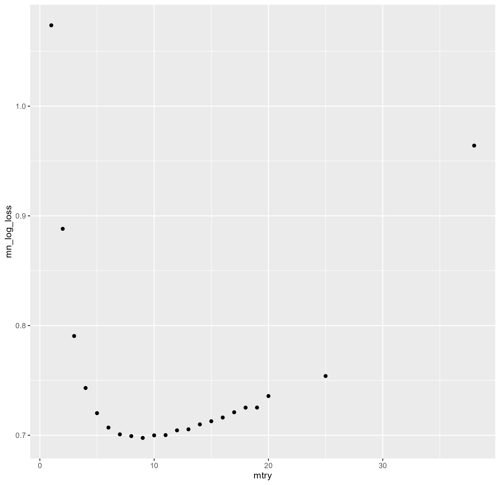
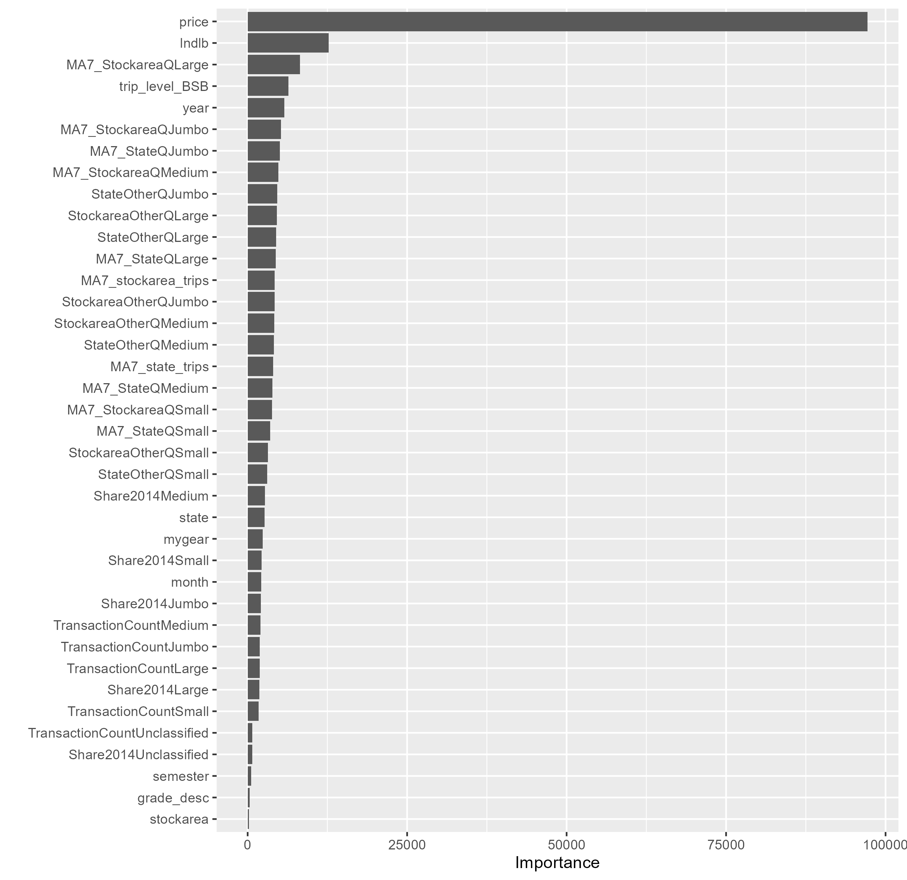
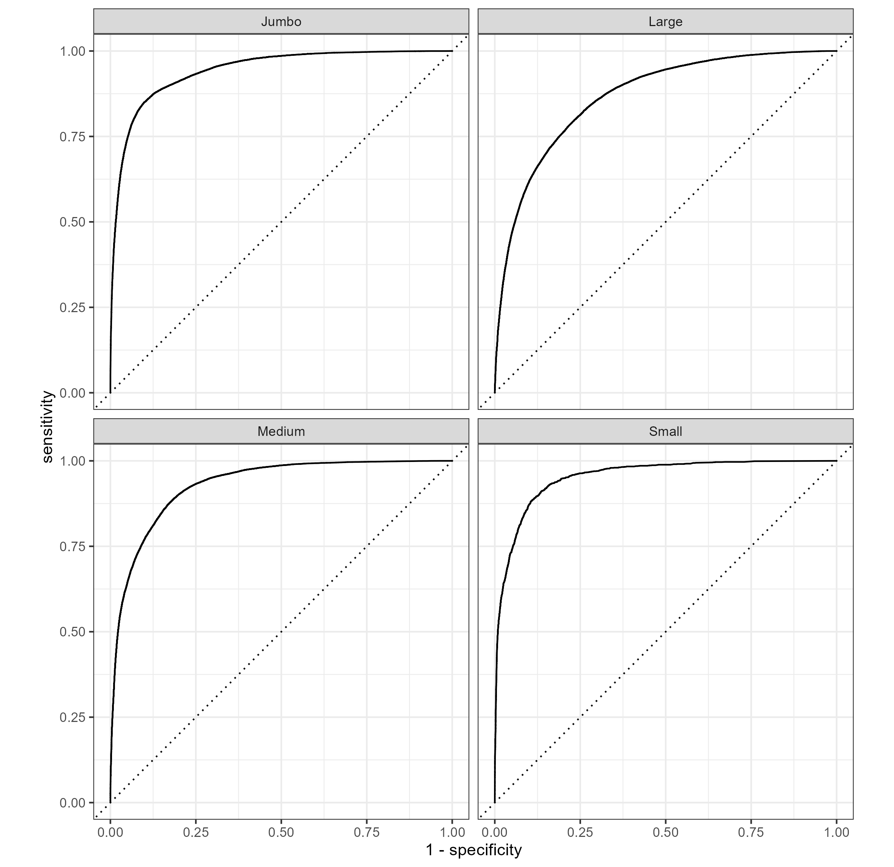
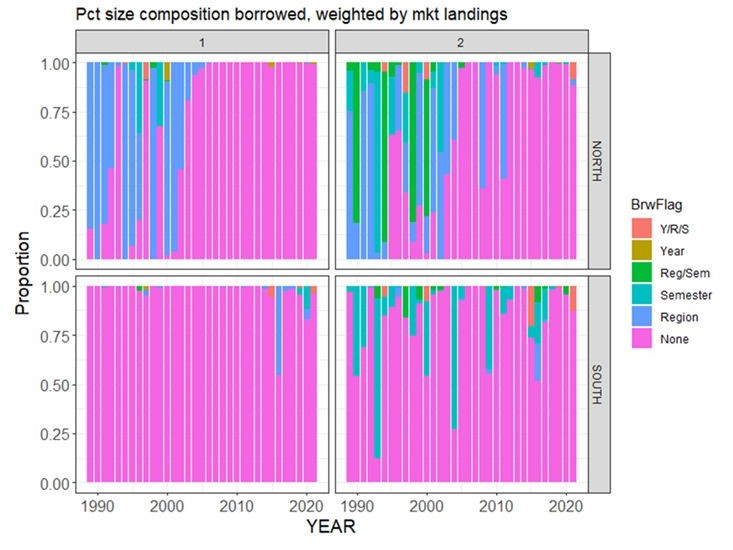

class: top, left

<style>
p.caption {
  font-size: 0.6em;
}
</style>

<style>
.reduced_opacity {
  opacity: 0.5;
}
</style>

```{r setup, include=FALSE}

options(htmltools.dir.version = FALSE)
knitr::opts_chunk$set(echo = F,
                      fig.retina = 3,
                      #fig.width = 4,
                      #fig.height = 2,
                      fig.asp = 0.45,
                      warning = F,
                      message = F)
#Plotting and data libraries
library(tidyverse)
library(here)
library(kableExtra)
library(DT)
library(widgetframe)
here::i_am("BlackSeaBass/20250417_EconomicInformedStockAssessments.Rmd")

# if figure output defaults to docs/images/ replace with this before moving to 
# presentations/docs in both the html output (search and replace)
# and folder name
# 20220316_MAFMCSSC_Gaichas_files/figure-html/

imagefolder<-"20250417_EconomicInformedStockAssessments"
imagefolder<-here("BlackSeaBass","20250417_EconomicInformedStockAssessments")

mlogit_preds<-read.csv(here("BlackSeaBass","20250417_EconomicInformedStockAssessments","data","mlogit_predictions_raw.csv"))
mlogit_colfreq_preds<-read.csv(here("BlackSeaBass","20250417_EconomicInformedStockAssessments","data","mlogit_predictions_col_freq.csv"))
mlogit_rowfreq_preds<-read.csv(here("BlackSeaBass","20250417_EconomicInformedStockAssessments","data","mlogit_predictions_row_freq.csv"))


```

```{r, load_refs,include=FALSE, cache=FALSE}
library(RefManageR)

BibOptions(check.entries = FALSE,
           bib.style = "authoryear",
           cite.style = "authoryear",
           longnamesfirst = FALSE,
           max.names = 1,
           style = "markdown")
myBib <- ReadBib("./EconInformed.bib", check = FALSE)

# A large bib takes a while (10-20 seconds).
#,
#           hyperlink = FALSE,
#           dashed = FALSE

```

<!---
Use this to add a bottom note to a figure
.contrib[
Few managed species have binding limits; Management less likely playing a role
]

Use this to make a left list
.pull-left[

]

in-line cite with:  `r Cite(myBib, "carr2020expected")`
    + Contextual information
    + Report evolving since 2016
    + Fishery-relevant subset of full Ecosystem Status Reports

- Open science emphasis `r Cite(myBib, "bastille_improving_2020")`

- Used within Mid-Atlantic Fishery Management Council's Ecosystem Process `r Cite(myBib, "muffley_there_2020")`
 - Inline cite `r Citet(myBib, "muffley_there_2020")`


-->

# Acknowledgements
.pull-left[
** Thank you to** 
- Jennifer Dopkowski (OAR - Climate Program Office)
- Brian Linton (NEFSC)
- Scott Steinback (NEFSC)
]

.pull-right[

]


---
# Background I 

- Fishing vessels catch black sea bass

- Fishing vessels transfer their catch to dealers

--
- Dealers 
    - Sort catch into market categories, 
    - Pay the vessel,
    - Report sales info to NOAA Fisheries,
    - Sell to downstream customers

--

- NEFSC deploys biosamplers 
    - Measure lots of fish
    - Collect otoliths from some fish

--

- Numbers-at-age and numbers-at-length are inputs into stock assessment 
    - Fill "missing" data with neighbors


---
# Research Question and Motivation

## Research Question
Can we use prices to say something interesting about the size of Unclassified Black Sea Bass? 

--
**Yes we can**.

--
## Motivation

- No biosampling of the Unclassified fish from 2020-2023.     

--

- Collecting length and age information is costly.  Should we collect it for all
market catgories?


---
# Background II - Scallops and Prices

Price Depends on Size, scallops `r Cite(myBib, "Ardini2018")` are a nice example $^{1}$:


.footnote[[1] Other examples include `r Citet(myBib, c("McConnell2000","Kristofersson2007", "Hammarlund2015"))` ]

---
# Preliminaries I

1. Exploratory data analysis step: Do prices vary by size? 
  - Estimate a hedonic model: the price per pound is a function of the transaction level attributes, like market category, gear, and time of year

---
# Preliminaries II
<!---- Not shown are the effects of factor variables for gear,  state, calendar year, and month.
- Not show are the effects of total landings and total landings$^2$.
--->
```{r child=here("BlackSeaBass","20250417_EconomicInformedStockAssessments","results","hedonic_table_market_cats.md")}
```

---
# Methods Overview I

- Train a random forest classification model `r Cite(myBib, "Breiman2001")` using transaction-level data $^{2}$
on the four principle classes ($c=$Jumbo, Large, Medium, Small) 

.footnote[[2] GARFO's Catch Accounting and Monitoring System (CAMS): stockarea-gear allocated landings at the vessel-dealer-market category level]

  - **Tune** and **train** with a $k-$fold cross-validation
  - **Validate** on a hold-out sample
  - Finalize (retrain) on the entire dataset

--
  
- **Predict** out of sample on the "Unclassified"

--

- Use the results to construct a new length distribution of the landed black sea bass

---
# Assumptions, Potential Problems, and Some solutions

Assumption 1 -  Out-of-sample prediction is valid
  
  - Unclassified fish are the same as classified fish, we just don't observe their class
  - .gray[Concern: There are some transactions by non-federally permitted vessels]

--

Assumption 2 - Dealers have diverse but persistent tendencies in terms of how they classify fish

  - Example 1: Dealer A's Large is 17-20" while Dealer B's Large is 19-22"
  - Example 2: Dealer C only grades into "Large" or "Small"
  - Dealer ID should go into the model as a factor variable
      - Implications for Tuning and training: do a "group" split and $k-$fold 
      - Modified "target encoding" instead of "one-hot"

--

Assumption 3 -  Fishing vessels have similar tendencies to dealers

  - Fishing vessels do not perform the classification, therefore
  - We should **not** include vessel ID as factor variables

<!---
- If these are transactions (trip/subtrip) with true value, this is fine.
      - If these are transactions (trip/subtrip) with "imputed" or "assigned" value, they *probably cannot* be included in the model.
      - If these are aggregates of multiple transactions, they *probably cannot* be included, even if the true value reported.
--->

---
# Machine Learning with Random Forest

- Tune (*mtry*) and train a Random Forest on 80% of our data  (2015-2024)
  - Mean log loss as the criteria function. 
  - Very loosely, $Loss=I(Class) - \hat{P}(Class)$ 
  
- 10-fold cross validation $^{2}$ to find optimal *mtry* hyperparameters
  - Grouped on dealer ID so all of a dealer's observations are in exactly 1 fold
  - Avoid overfitting or over-optimism
  
-  Frequency weight observations : Landed Pounds

.footnote[[2] $k$-fold cross validation: Assign all observations to exactly 1 fold.  Run the Random Forest on all but 1 fold, compute mean log-loss.  Repeat.]

---
# Predictors:

.pull-left[
Factor Variables:

   - Gear : Trawl, Line, Pot/Trap, Gillnet, Other
   - Stock: North or South
   - State of Landing: North Carolina to Maine
   - Year: 2015-2025 
   - Month
   - Semester
   - Live or Dead  
]

.pull-right[
Continuous: 
  - Price
  - Trip landings
  - Trip landings by market cat 
  - Aggregate landings 
      - State landings by market cat on other trips*
      - Stock area landings by market cat on other trips*
      - 7 day moving average landings by market category
  - Dealer specific effects: "modified target encoding" (dealer share of previous purchases by market category) 

]   

---
# Model Tuning Results

We use mean log-loss to select optimal *mtry.*

.center[

]


---
# Variable Importance
.center[

]

---
# Validation
.pull-left[

]

.pull-right[
Receiver-Operator Curve for our model. We trained the model on 80%, and then predict on the 20% hold out sample.

Haven't gotten to the "confusion" matrix or weighted predictions yet.

]


 
---
#  Predictions

Not done yet
 
---
# Extensions
.pull-left[
  - Should we collect age and length data for all
market catgories?

- Can we modify the way lengths have been borrowed?

- Can we apply these methods to other stocks? 
]

.pull-right[
]


---
# Further Reading

-  Machine Learning for Economists: `r Citet(myBib, c("Varian2014","Athey2017", "Storm2020"))`

-  Machine Learning:  `r Citet(myBib, c("Breiman1984", "Breiman2001", "Hastie2009","Kuhn2013a", "Bates2024"))` 


---
# References
.contrib[
```{r refs, echo=FALSE, results="asis", eval=TRUE}
PrintBibliography(myBib, .opts=list(max.names=3))
```
]

