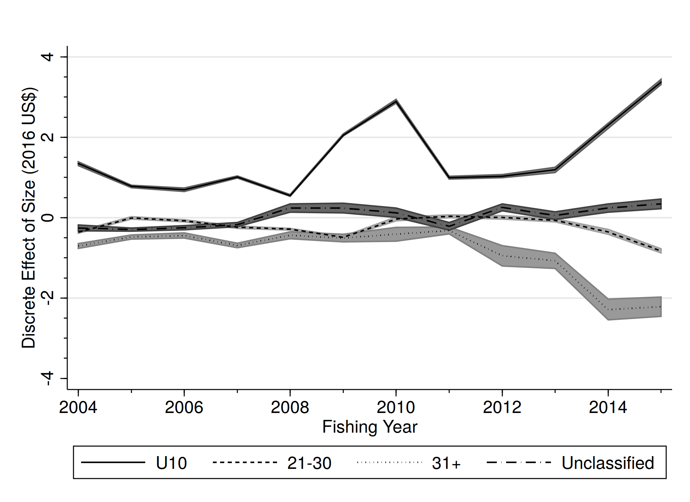
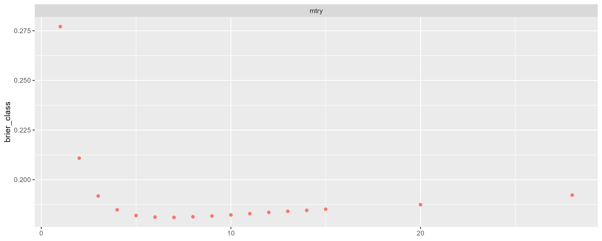
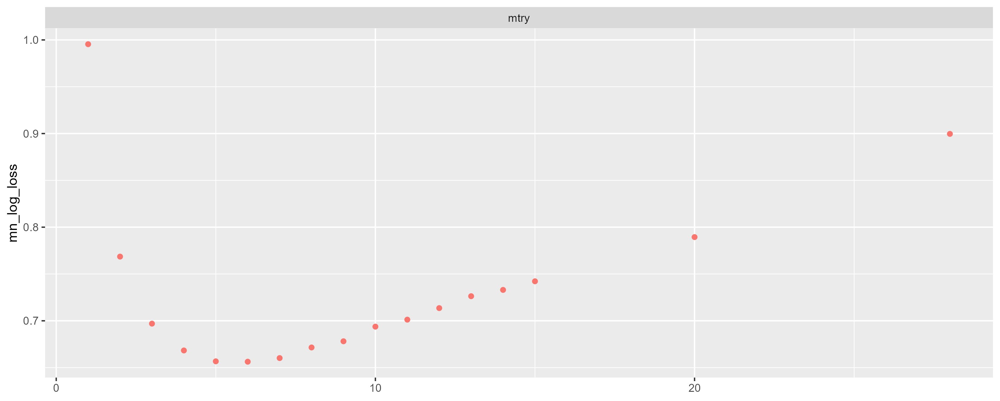

class: top, left

<style>
p.caption {
  font-size: 0.6em;
}
</style>

<style>
.reduced_opacity {
  opacity: 0.5;
}
</style>

```{r setup, include=FALSE}

options(htmltools.dir.version = FALSE)
knitr::opts_chunk$set(echo = F,
                      fig.retina = 3,
                      #fig.width = 4,
                      #fig.height = 2,
                      fig.asp = 0.45,
                      warning = F,
                      message = F)
#Plotting and data libraries
library(tidyverse)
library(here)
library(kableExtra)
library(DT)
library(widgetframe)
here::i_am("BlackSeaBass/20250417_EconomicInformedStockAssessments.Rmd")

# if figure output defaults to docs/images/ replace with this before moving to 
# presentations/docs in both the html output (search and replace)
# and folder name
# 20220316_MAFMCSSC_Gaichas_files/figure-html/

imagefolder<-"20250417_EconomicInformedStockAssessments"
imagefolder<-here("BlackSeaBass","20250417_EconomicInformedStockAssessments")

mlogit_preds<-read.csv(here("BlackSeaBass","20250417_EconomicInformedStockAssessments","data","mlogit_predictions_raw.csv"))
mlogit_colfreq_preds<-read.csv(here("BlackSeaBass","20250417_EconomicInformedStockAssessments","data","mlogit_predictions_col_freq.csv"))
mlogit_rowfreq_preds<-read.csv(here("BlackSeaBass","20250417_EconomicInformedStockAssessments","data","mlogit_predictions_row_freq.csv"))


```

```{r, load_refs,include=FALSE, cache=FALSE}
library(RefManageR)

BibOptions(check.entries = FALSE,
           bib.style = "authoryear",
           cite.style = "authoryear",
           longnamesfirst = FALSE,
           max.names = 1,
           style = "markdown")
myBib <- ReadBib("./EconInformed.bib", check = FALSE)

# A large bib takes a while (10-20 seconds).
#,
#           hyperlink = FALSE,
#           dashed = FALSE

```

<!---
Use this to add a bottom note to a figure
.contrib[
Few managed species have binding limits; Management less likely playing a role
]

Use this to make a left list
.pull-left[

]

in-line cite with:  `r Cite(myBib, "carr2020expected")`
    + Contextual information
    + Report evolving since 2016
    + Fishery-relevant subset of full Ecosystem Status Reports

- Open science emphasis `r Cite(myBib, "bastille_improving_2020")`

- Used within Mid-Atlantic Fishery Management Council's Ecosystem Process `r Cite(myBib, "muffley_there_2020")`
 - Inline cite `r Citet(myBib, "muffley_there_2020")`


-->

# Acknowledgements
.pull-left[
** Thank you to** 
- Jennifer Dopkowski (NOAA Research - Climate Program Office)
- Brian Linton (NEFSC)
- Scott Steinback (NEFSC)
]

.pull-right[

]


---
# Research Question and Motivation

## Research Question
Can we use prices to say something interesting about the size of Unclassified Black Sea Bass? (**Yes we can**).

## Motivation

* From 2020 to 2023, 5 to 10% of commercial landings were in the “Unclassified” market category; but no fish in this category were measured. 

* It is costly to collect length and age information.  Is trying to collect this information for all market categories the most efficient use of our resources?


---
# Background
For years, economists have asked the opposite question: how much more do buyers pay for large fish compared to small fish? `r Cite(myBib, "McConnell2000")`

Scallops `r Cite(myBib, "Ardini2018")`are a nice example with clean separation:




---
## Cod is another example

.pull-left[

]


.pull-right[

]

But the separation is not as clean.


.footnote[
`r Cite(myBib, "Lee2014")`
]

---
# Methods Overview I 

1. Exploratory data analysis step: Do prices vary by size? 
  - Estimate a hedonic model: the price per pound is a function of the transaction level attributes, like market category, gear, and time of year. 
  - A slightly more sophisticated way of checking that prices vary by market category than the box plots from the previous slide.
  
---
# Methods Overview II 

3.  Train a random forest classification model on the four principle classes (Jumbo, Large, Medium, Small).  
  - **Test** and **train** with a k-fold cross-validation.
  - **Validate** on a hold-out sample.
  - Retrain on the entire dataset.
  
4.  **Predict** out of sample on the "Unclassified".

5.  Using the results of (4) reconstruct a new length distribution of the landed black sea bass.  

---
# Pitfalls

**Predict** out of sample on the "Unclassified."  Is the data generating process
the same for Unclassified as it is for Classified?


Data is such a bear.
  - Less QA/QC on the "value" columns (value, sppvalue). 
  - State-level reporting.  There are rows in the dealer data that are state-level reports of sales by non-federal permits to non-federal dealers. 
      - If these are transactions (trip/subtrip) with true value, this is fine.
      - If these are transactions (trip/subtrip) with "imputed" or "assigned" value, they *probably cannot* be included in the model.
      - If these are aggregates of multiple transactions, they *probably cannot* be included, even if the true value reported.
Price Separation: Prices need to vary by market category. 
  - No variation in prices across market categories, then it won't work
  - No need to assumed a particular price-size relationship
  - Price-size relationship can change from year to year
  - Better if the price of "Unclassified" is between the price of two other categories.

---
# More Pitfalls

Dealers have their own diverse but persistent tendencies in terms of how they classify fish.
  - Example 1: Dealer A's Large is 17-20" while Dealer B's Large is 19-22"
  - Example 2: Dealer C only grades into "Large" or "Small"
  - Dealer id should go into the model as a factor variable. 

Problems: 
  - Need to handle this properly in the $k-$fold cross validation, otherwise the training and validation datasets are not truly independent and the model fit measures are overly optimistic. 
  - Would want to include a dealer "fixed effect" as to account the dealer's tendencies.  If all observations of cluster $c$ are in fold $k$, then I don't know how you use that info to predict.
  - Inclusion of factor variables with many levels in a machine learning model can lead to overfitting. "Target" encode instead of "one-hot" (classical expansion of factor into a set of 0/1 dummy variables).

---
# Hedonic Results
.left-column[
- Estimates in the columns can be interpreted as the average price of a pound of Black Sea Bass for each market category.
- Not shown are the effects of factor variables for gear,  state, calendar year, and month.
- Not show are the effects of total landings and total landings$^2$.
]
.right-column[
```{r child=here("BlackSeaBass","20250417_EconomicInformedStockAssessments","results","hedonic_table_market_cats.md")}
```
]

---
## Multinomial Logit
.left-column[
- Estimates greater than 1 indicate that increases in a predictor increase the 
chances of transaction being in a particular market category relative to large.
- Not shown are factor variables for month, year, and state
]
.right-column[
```{r child=here("BlackSeaBass","20250417_EconomicInformedStockAssessments","results","mlogitNom_short.md")}
```
]

---
## Multinomial Logit predictions

I predicted each of the four class probabilities for every transaction.

I multiplied the predictions by the *lndlb* for each transaction and then summed by market category.

```{r}
kbl(mlogit_preds, digits=0,booktabs=T, align=c("l",rep('r',times=4)), caption =  "Predicted Category (mt) after a multinomial logit.  Main diagonal indicates a correct prediction, off diagonal terms are incorrect predictions. 2018-2024")  %>%
    #column_spec(5:8, width = "2cm")
    kable_styling(full_width = F) %>%
      row_spec(0,bold=FALSE) 

```
The mechanics of the logit mean that the model is correct: the row sums are equal to the column sums.


---
## Multinomial Logit predictions II


```{r}
kbl(mlogit_rowfreq_preds, digits=2,booktabs=T, align=c("l",rep('r',times=4)), caption =  "Predicted Category after a multinomial logit, expressed as a row frequency(2018-2024)")  %>%
    #column_spec(5:8, width = "2cm")
    kable_styling(full_width = F) %>%
      row_spec(0,bold=FALSE) 

```

This is kind of not great. Plus, it's an "in sample" prediction, so it's overly optimistic 

---
## Machine Learning with Random Forest

- I trained and tuned a Random Forest on 40% of my data.  I used 10% as a hold out sample. 
- More predictors, so it's not really a fair comparison to the logit. Factor have a *
   - Factors: Gear (5), Stockarea (2), state (9), Year (7), Month (12), Semester (2), Grade (1)  
   - Continuous: Price, Landed pounds
   - Frequency Weights: Landed Pounds
   - 
- Tuned with mtry in 1:15, 20, and 38

<!---
myfolds<-rsample::group_vfold_cv(train_data, group=dlrid, v = 10, balance="observations")


mtry<-1:15
mtry<-c(mtry,20,npredict)
# Use a recipe on the training data. 

# assign roles to predictors, outcome, groups, and weights
BSB.Classification.Recipe <- recipe(train_data) %>%
  update_role(market_desc, new_role = "outcome")%>%
  update_role(c(dlrid,camsid), new_role = "ID variable") %>%
  update_role(c(mygear,price,stockarea, state, year, month, semester, lndlb, grade_desc, trip_level_BSB), new_role = "predictor")

# State-level daily Landings on "other" trips, by market category  
BSB.Classification.Recipe <-BSB.Classification.Recipe %>%
  update_role(c(StateOtherQJumbo, StateOtherQLarge, StateOtherQMedium, StateOtherQSmall), new_role = "predictor") 

# stockarea-level daily Landings on "other" trips, by market category  
BSB.Classification.Recipe <-BSB.Classification.Recipe %>%
  update_role(c(StockareaOtherQJumbo, StockareaOtherQLarge, StockareaOtherQMedium, StockareaOtherQSmall), new_role = "predictor") 

# Trailing 7 days landings, by stockarea and market category   
BSB.Classification.Recipe <-BSB.Classification.Recipe %>%
  update_role(c(MA7_StockareaQJumbo, MA7_StockareaQLarge, MA7_StockareaQMedium, MA7_StockareaQSmall), new_role = "predictor")

# Trailing 7 days landings, by state and market category   
BSB.Classification.Recipe <-BSB.Classification.Recipe %>%
  update_role(c(MA7_StateQJumbo, MA7_StateQLarge, MA7_StateQMedium, MA7_StateQSmall), new_role = "predictor") 

# Trailing 7 day trips, by state and stock area.   
BSB.Classification.Recipe <-BSB.Classification.Recipe %>%
  update_role(c(MA7_stockarea_trips, MA7_state_trips), new_role = "predictor") 

# Dealer share of landings by market category from 2013-2017   
BSB.Classification.Recipe <-BSB.Classification.Recipe %>%
  update_role(c(ShareJumbo, ShareLarge, ShareMedium,ShareSmall, ShareUnclassified), new_role = "predictor") 

# Dealer transaction count of landings by market category from 2013-2017   

BSB.Classification.Recipe <-BSB.Classification.Recipe %>%
  update_role(c(TransactionCountJumbo, TransactionCountLarge, TransactionCountMedium,TransactionCountSmall, TransactionCountUnclassified), new_role = "predictor") 


# You can't center the factor variables
# rescale and recenter 
BSB.Classification.Recipe <- BSB.Classification.Recipe %>% 
#  step_impute_knn(all_predictors()) %>%
  step_center(all_numeric_predictors()) %>%
  step_scale(all_numeric_predictors())

recipe_summary<-BSB.Classification.Recipe %>%
  summary() %>%
  arrange(source,role, variable)


#How many predictors
npredict<-nrow(recipe_summary %>% dplyr::filter(role=="predictor"))

--->


---
# Preliminary fit assessments

 
.pull-left[

]
 
 .pull-right[

]

---
# Preliminary fit assessments

Fair..also wrong not from the same model fit as previous

.pull-right[

]
 
---
#  Predictions

Haven't written the code yet. I can get the 'class predictions' for the "transactions", but
I haven't figured out how to get the weights out.

 
---
# Extensions
.left-column[
- Can we modify the way lengths have been borrowed?
- Can we apply these methods to other stocks?  Which stocks?
- If it works well, can port sampling effort be re-deployed away from categories that are hard to get?
]

.right-column[

]

---
# End Matter
.pull-left[
**Additional resources**
]

## References
.contrib[
```{r refs, echo=FALSE, results="asis", eval=TRUE}
PrintBibliography(myBib, .opts=list(max.names=3))
```
]

