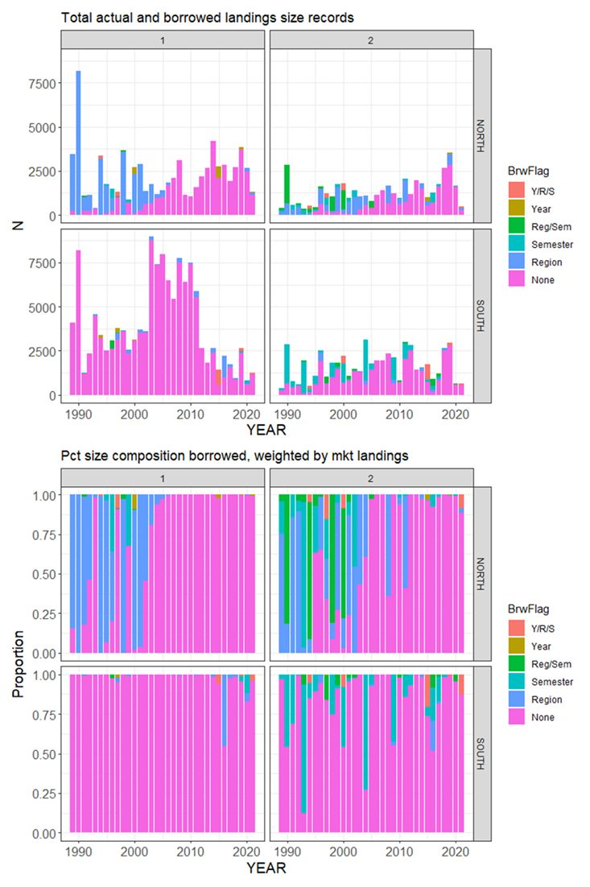

class: top, left

<style>
p.caption {
  font-size: 0.6em;
}
</style>

<style>
.reduced_opacity {
  opacity: 0.5;
}
</style>

```{r setup, include=FALSE}

options(htmltools.dir.version = FALSE)
knitr::opts_chunk$set(echo = F,
                      fig.retina = 3,
                      #fig.width = 4,
                      #fig.height = 2,
                      fig.asp = 0.45,
                      warning = F,
                      message = F)
#Plotting and data libraries
library(tidyverse)
library(here)
library(kableExtra)
library(DT)
library(widgetframe)
here::i_am("BlackSeaBass/20250417_EconomicInformedStockAssessments.Rmd")

# if figure output defaults to docs/images/ replace with this before moving to 
# presentations/docs in both the html output (search and replace)
# and folder name
# 20220316_MAFMCSSC_Gaichas_files/figure-html/

imagefolder<-"20250417_EconomicInformedStockAssessments"
imagefolder<-here("BlackSeaBass","20250417_EconomicInformedStockAssessments")

mlogit_preds<-read.csv(here("BlackSeaBass","20250417_EconomicInformedStockAssessments","data","mlogit_predictions_raw.csv"))
mlogit_colfreq_preds<-read.csv(here("BlackSeaBass","20250417_EconomicInformedStockAssessments","data","mlogit_predictions_col_freq.csv"))
mlogit_rowfreq_preds<-read.csv(here("BlackSeaBass","20250417_EconomicInformedStockAssessments","data","mlogit_predictions_row_freq.csv"))


```

```{r, load_refs,include=FALSE, cache=FALSE}
library(RefManageR)

BibOptions(check.entries = FALSE,
           bib.style = "authoryear",
           cite.style = "authoryear",
           longnamesfirst = FALSE,
           max.names = 1,
           style = "markdown")
myBib <- ReadBib("./EconInformed.bib", check = FALSE)

# A large bib takes a while (10-20 seconds).
#,
#           hyperlink = FALSE,
#           dashed = FALSE

```

<!---
Use this to add a bottom note to a figure
.contrib[
Few managed species have binding limits; Management less likely playing a role
]

Use this to make a left list
.pull-left[

]

in-line cite with:  `r Cite(myBib, "carr2020expected")`
    + Contextual information
    + Report evolving since 2016
    + Fishery-relevant subset of full Ecosystem Status Reports

- Open science emphasis `r Cite(myBib, "bastille_improving_2020")`

- Used within Mid-Atlantic Fishery Management Council's Ecosystem Process `r Cite(myBib, "muffley_there_2020")`
 - Inline cite `r Citet(myBib, "muffley_there_2020")`


-->

# Acknowledgements
.pull-left[
** Thank you to** 
- Jennifer Dopkowski (NOAA Research - Climate Program Office)
- Brian Linton (NEFSC)
- Scott Steinback (NEFSC)
]

.pull-right[

]


---
# Research Question and Motivation

## Research Question
Can we use prices to say something interesting about the size of Unclassified Black Sea Bass? (**Yes we can**).

## Motivation

* From 2020 to 2023, 5 to 10% of commercial landings were in the “Unclassified” market category; but no fish in this category were measured. 

* It is costly to collect length and age information.  Is trying to collect this information for all market categories the most efficient use of our resources?


---
# Background
For years, economists have asked the opposite question: how much more do buyers pay for large fish compared to small fish? `r Cite(myBib, "McConnell2000")`

Scallops `r Cite(myBib, "Ardini2018")`are a nice example with clean separation:


---
## Cod is another example

.pull-left[

]


.pull-right[

]

But the separation is not as clean.


.footnote[
`r Cite(myBib, "Lee2014")`
]

---
# Methods Overview I 

1. Exploratory data analysis step: Do prices vary by size? 
  - Estimate a hedonic model: the price per pound is a function of the transaction level attributes, like market category, gear, and time of year. 
  - A slightly more sophisticated way of checking that prices vary by market category than the box plots from the previous slide.
  
---
# Methods Overview II 

3.  Train a random forest classification model on the four principle classes (Jumbo, Large, Medium, Small).  
  - **Test** and **train** with a k-fold cross-validation.
  - **Validate** on a hold-out sample.
  - Retrain on the entire dataset.
  
4.  **Predict** out of sample on the "Unclassified".

5.  Using the results of (4) reconstruct a new length distribution of the landed black sea bass.  

---
# Pitfalls

**Predict** out of sample on the "Unclassified."  Is the data generating process
the same for Unclassified as it is for Classified?


Data issues
  - Less QA/QC on the "value" columns (value, sppvalue). 
  - State-level reporting.  There are rows in the dealer data that are state-level reports of sales by non-federal permits to non-federal dealers. 
      - If these are transactions (trip/subtrip) with true value, this is fine.
      - If these are transactions (trip/subtrip) with "imputed" or "assigned" value, they *probably cannot* be included in the model.
      - If these are aggregates of multiple transactions, they *probably cannot* be included, even if the true value reported.

---
# More Pitfalls

Dealers may have diverse but persistent tendencies in terms of how they classify fish.
  - Example 1: Dealer A's Large is 17-20" while Dealer B's Large is 19-22"
  - Example 2: Dealer C only grades into "Large" or "Small"
  - Dealer id should go into the model as a factor variable. 

Problems: 
  - Need to handle this properly in the $k-$fold cross validation, otherwise the training and validation datasets are not truly independent and the model fit measures are overly optimistic. 
  - Would want to include a dealer "fixed effect" as to account the dealer's tendencies.  If all observations of cluster $c$ are in fold $k$, then I don't know how you use that info to predict.
  - Inclusion of factor variables with many levels in a machine learning model can lead to overfitting. "Target" encode instead of "one-hot" (classical expansion of factor into a set of 0/1 dummy variables).

---
# Hedonic Results
<!---- Not shown are the effects of factor variables for gear,  state, calendar year, and month.
- Not show are the effects of total landings and total landings$^2$.
--->
```{r child=here("BlackSeaBass","20250417_EconomicInformedStockAssessments","results","hedonic_table_market_cats.md")}
```

---
## Machine Learning with Random Forest

- Tune (mtry) and train a Random Forest on 80% of my data from 2015-2024.  I used 20% as a hold out sample. 

- 10-fold cross validation to find optimal mtry
  - Grouped on dealer id so each dealer is in exactly 1 fold
  - Avoid overfitting or over-optimism
  
- Predictors:
   - Factors: Gear (5), Stock (2), State (9), Year (10), Month (12), Semester (2), Live (2)  
   - Continuous: Price, trip landings, trip landings by market cat, state landings by market cat, stock area landings by market cat, moving average of landings by market category
   - Frequency Weights: Landed Pounds
   - Dealer specific effects: "modified target encoding" (dealer share of previous purchases by market category) 
   
<!---
keep_cols<-c("market_desc","dlrid","camsid","weighting", "mygear","price","priceR_CPI", "stockarea","state", "year","month", "semester","lndlb", "grade_desc", "trip_level_BSB")
keep_cols<-c(keep_cols,"StateOtherQJumbo", "StateOtherQLarge", "StateOtherQMedium", "StateOtherQSmall" )
keep_cols<-c(keep_cols,"StockareaOtherQJumbo", "StockareaOtherQLarge", "StockareaOtherQMedium", "StockareaOtherQSmall" )
keep_cols<-c(keep_cols,"MA7_StockareaQJumbo", "MA7_StockareaQLarge", "MA7_StockareaQMedium", "MA7_StockareaQSmall" )
keep_cols<-c(keep_cols,"MA7_StateQJumbo", "MA7_StateQLarge","MA7_StateQMedium", "MA7_StateQSmall")
keep_cols<-c(keep_cols,"MA7_stockarea_trips", "MA7_state_trips" )
keep_cols<-c(keep_cols,"Share2014Jumbo", "Share2014Large", "Share2014Medium","Share2014Small", "Share2014Unclassified" )
keep_cols<-c(keep_cols,"TransactionCountJumbo", "TransactionCountLarge", "TransactionCountMedium", "TransactionCountSmall", "TransactionCountUnclassified" )
--->


---
# Model Tuning Results

We use mean log-loss to select optimal *mtry.*


---
# Out of Sample Prediction


---
# Variable Importance

Well look at that....


 
---
#  Predictions

Haven't written the code yet. I can get the 'class predictions' for the "transactions", but
I haven't figured out how to get the weights out.

 
---
# Extensions
.left-column[
- Can we modify the way lengths have been borrowed?
- Can we apply these methods to other stocks?  Which stocks?
- If it works well, can port sampling effort be re-deployed away from categories that are hard to get?
]

.right-column[

]

---
# End Matter
.pull-left[
**Additional resources**
]

## References
.contrib[
```{r refs, echo=FALSE, results="asis", eval=TRUE}
PrintBibliography(myBib, .opts=list(max.names=3))
```
]

