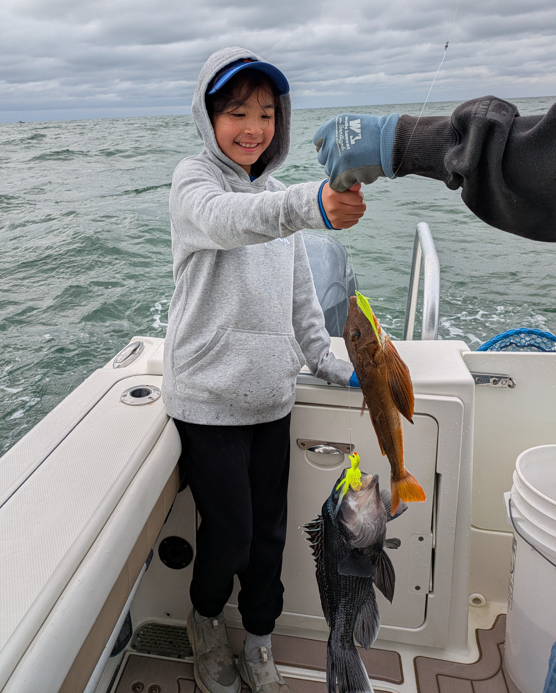
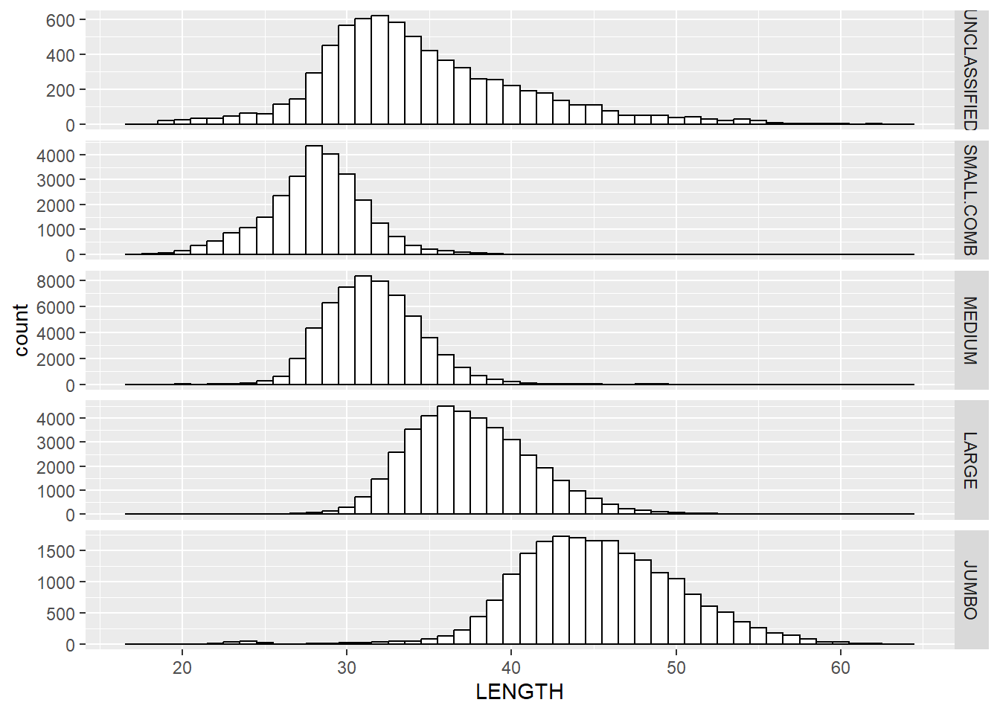
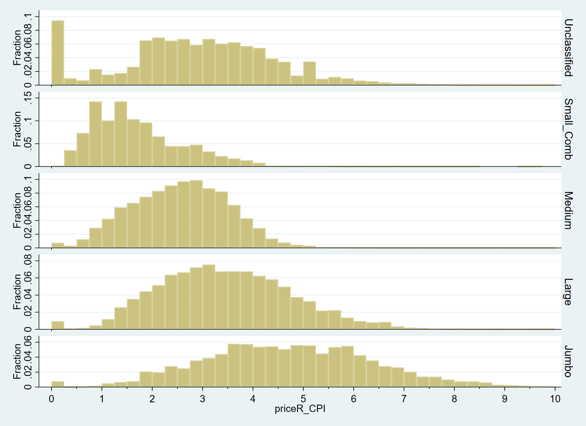
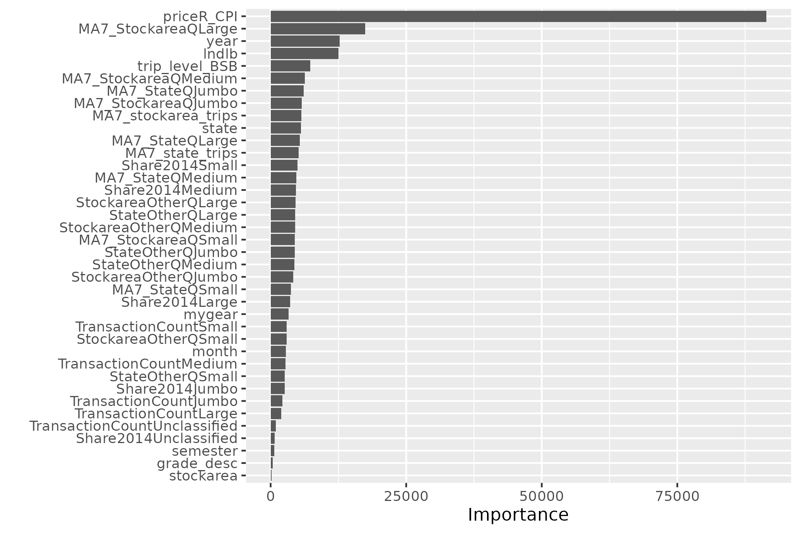
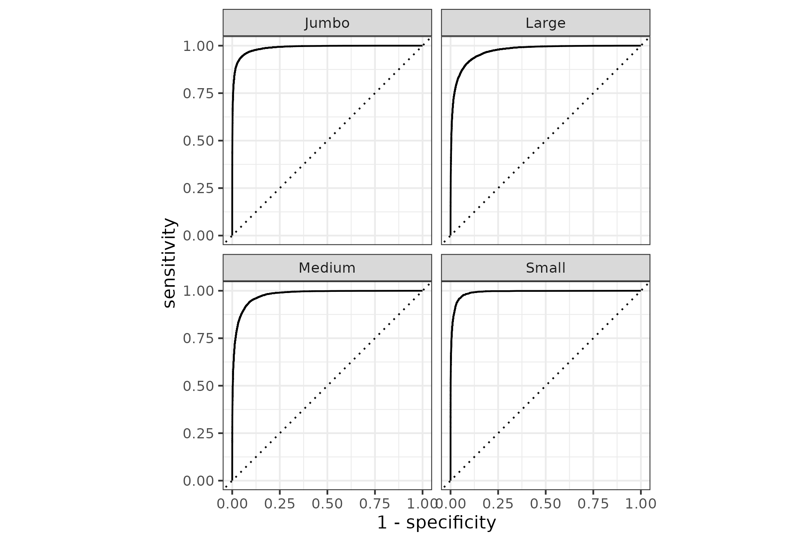
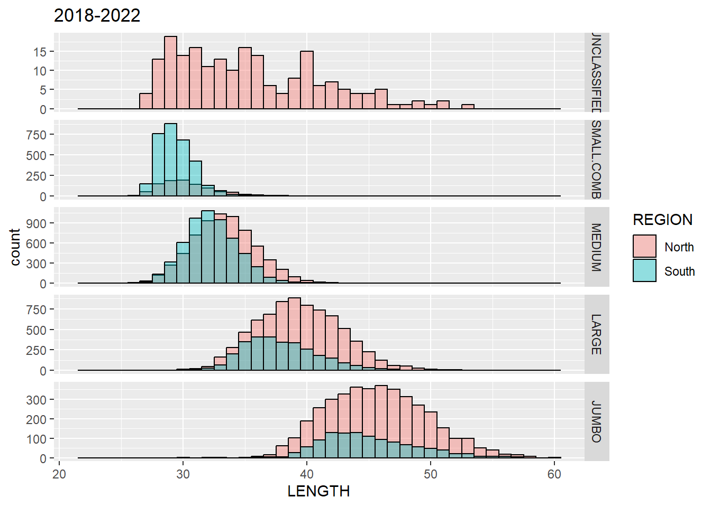
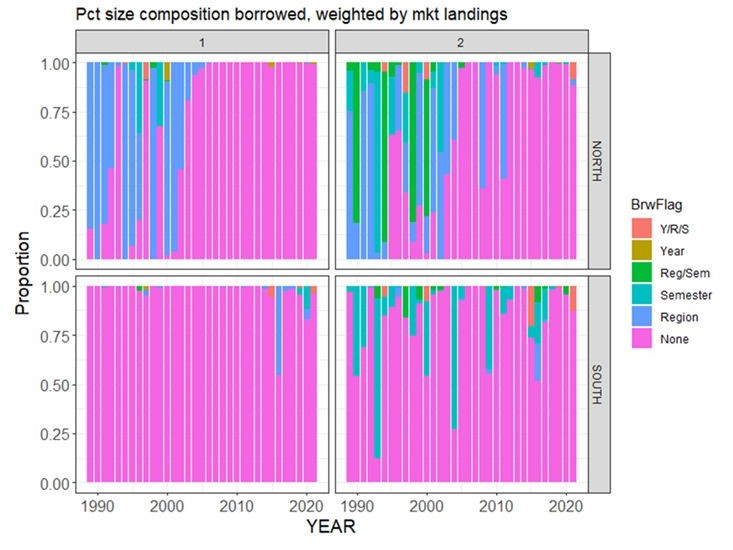

class: top, left

<style>
p.caption {
  font-size: 0.6em;
}
</style>

<style>
.reduced_opacity {
  opacity: 0.5;
}
</style>

```{r setup, include=FALSE}

options(htmltools.dir.version = FALSE)
knitr::opts_chunk$set(echo = F,
                      fig.retina = 3,
                      #fig.width = 4,
                      #fig.height = 2,
                      fig.asp = 0.45,
                      warning = F,
                      message = F)
#Plotting and data libraries
library(tidyverse)
library(here)
library(kableExtra)
library(DT)
library(widgetframe)
here::i_am("BlackSeaBass/20250612_EconomicInformedStockAssessments.Rmd")

options(scipen=0)

lbs_per_mt<-2204.62

# if figure output defaults to docs/images/ replace with this before moving to 
# presentations/docs in both the html output (search and replace)
# and folder name
# 20220316_MAFMCSSC_Gaichas_files/figure-html/

imagefolder<-"20250612_EconomicInformedStockAssessments"
imagefolder<-here("BlackSeaBass","20250612_EconomicInformedStockAssessments")


nocluster_testing_predictions<-readRDS(here("BlackSeaBass","20250612_EconomicInformedStockAssessments","data","aggregate_test_predictions_nocluster2025-05-24.Rds"))

nocluster_full_predictions<-readRDS(here("BlackSeaBass","20250612_EconomicInformedStockAssessments","data","aggregate_full_predictions_nocluster2025-05-24.Rds"))

aggregate_oos_predictions<-readRDS(here("BlackSeaBass","20250612_EconomicInformedStockAssessments","data","aggregate_oos_predictions_nocluster2025-05-24.Rds"))


```

```{r, load_refs,include=FALSE, cache=FALSE}
library(RefManageR)

BibOptions(check.entries = FALSE,
           bib.style = "authoryear",
           cite.style = "authoryear",
           longnamesfirst = FALSE,
           max.names = 1,
           style = "markdown")
myBib <- ReadBib("./EconInformed.bib", check = FALSE)

# A large bib takes a while (10-20 seconds).
#,
#           hyperlink = FALSE,
#           dashed = FALSE

```

<!---
Use this to add a bottom note to a figure
.contrib[
Few managed species have binding limits; Management less likely playing a role
]

Use this to make a left list
.pull-left[

]

in-line cite with:  `r Cite(myBib, "carr2020expected")`
    + Contextual information
    + Report evolving since 2016
    + Fishery-relevant subset of full Ecosystem Status Reports

- Open science emphasis `r Cite(myBib, "bastille_improving_2020")`

- Used within Mid-Atlantic Fishery Management Council's Ecosystem Process `r Cite(myBib, "muffley_there_2020")`
 - Inline cite `r Citet(myBib, "muffley_there_2020")`


-->

# Getting Started

.pull-left[
## Acknowledgements
- Jennifer Dopkowski (OAR - Climate Program Office)
- Brian Linton (NEFSC)
- Scott Steinback (NEFSC)
- Geret DePiper (NEFSC)

## Today, we are looking for

- Feedback on data, methods.
- Other species and stocks where this might work.

]

.pull-right[
 
 
]


---
# Research Question and Motivation

## Research Question
Can we use prices to infer the size of Unclassified Black Sea Bass? 

## Motivation

- No biosampling of the Unclassified fish from 2020-2024.
- 19% of landings in the south and 7% of landings in the north during this time.
- Collecting length and age information is costly.  How can we exploit other sources of information?

---

# Background

- Dealers:
    - Sort a vessel's catch into market categories.
    - Report weight, value, vessel id, trip identifier to NOAA Fisheries.
    - Sell to downstream customers.

--

- Stock Assessment Enterprise: 
    - Measure lots of fish.
    - Collect otoliths from some fish.
    - Numbers-at-age and numbers-at-length are inputs into stock assessment.
    
---
# Market Categories: Lengths and Prices

.pull-left[

]

.pull-right[

]

---

# Methods Overview 

- Train a random forest classification model  `r Cite(myBib, "Breiman2001")`  using CAMS data for the four principle classes (Jumbo, Large, Medium, and Small).


- **Predict** out of sample on the "Unclassified."


- Use the results to construct a new length distribution of the landed black sea bass.

---
# Methods Detail I   

- Classification trees perform recursive binary splitting.  The dependent variable is repeatedly partitioned into two groups based on a single explanatory variable based on minimizing within group variation.


- Random Forests are "bootstraps" of classification trees, where a different subset of explanatory factors is used in each bootstrap.


- **Tune** with a $10-$fold cross-validation on 90% of the data (2015-2024).
    - select *mtry* (number of factors) using Brier classification as the criteria function.
    - $Brier=\frac{1}{2n} \sum_{i} \sum_j (y_{ij}- \hat{P_i}(Class_j))^2$
    

.footnote[
mtry: The number of randomly selected predictors that go into the Classification Tree.

Brier $\tilde$ Sum of Squared Errors 
]

---
# Methods Detail II   

- With the optimum *mtry*, **train** the final random forest model.

- **Validate** on the 10\% hold-out sample.

- CAMS data for the four principle classes (Jumbo, Large, Medium, and Small).

- Frequency weight observations : Landed Pounds.


---
# Predictors

.pull-left[
Factor Variables:

   - Gear : Trawl, Line, Pot/Trap, Gillnet, Other
   - Stock: North or South
   - State of Landing: North Carolina to Maine
   - Year: 2015-2025 
   - Month
   - Semester
   - Live or Dead  
]

.pull-right[
Continuous: 
  - Real Price
  - Trip landings
  - Trip landings by market cat 
  - Proxies for "what is out there" 
      - State landings by market cat on other trips*
      - Stock area landings by market cat on other trips*
      - 7 day moving average landings by market category
  - Dealer specific effects: "modified target encoding" (dealer share of previous purchases by market category) 
]   

Economic theory and content expertise play a crucial role in guiding where the algorithm looks for structure first. `r Cite(myBib, "Mullainathan2017")`

---
# Assumptions, Potential Problems, and Some Solutions

Assumption 1 -  Out-of-sample prediction is valid
  
  - Unclassified fish just like classified fish, except we don't observe their class.
  - Concern: There are some transactions by non-federally permitted vessels.

--

Assumption 2 - Dealers have persistent tendencies in terms of how they classify fish.

  - Example 1: Dealer A's Large is 17-20" while Dealer B's Large is 19-22."
  - Example 2: Dealer C only grades into "Large" or "Small."
  - Solution: Dealer ID should go into the model as a factor variable.
      - Modified "target encoding" instead of "one-hot"  `r Cite(myBib, "Strobl2007")`.

<!---
- If these are transactions (trip/subtrip) with true value, this is fine.
      - If these are transactions (trip/subtrip) with "imputed" or "assigned" value, they *probably cannot* be included in the model.
      - If these are aggregates of multiple transactions, they *probably cannot* be included, even if the true value reported.
--->


---
# Market Categories: Lengths and Prices

.pull-left[

]

.pull-right[

]

---

# Variable Importance
.center[

]

---
# Validation
.pull-left[

Receiver Operating Characteristic Curve for the 10% validation hold-out sample.
]
.pull-right[

* Recall: we fit the model on one dataset and this ROC curve is based on the 10% validation sample.
* Looks really good.  Too good?
* True positive rate (vertical axis) vs false positive rate (horizontal axis) for every possible probability cutoff.
]


---
# Validation II -- Underpredicting the Jumbo Class


```{r nocluster_predictions}

# "confusion matrix" predictions, in pounds, by stockarea and market_category
testing_predictions<-nocluster_testing_predictions %>%
  group_by(stockarea,market_desc) %>%
    summarise(across(c(pred_Jumbo,pred_Large,pred_Medium,pred_Small), sum))

# true landings by stockarea and market_category

true<-nocluster_testing_predictions %>%
  mutate(market_desc=as.character(market_desc))%>%
    group_by(stockarea,market_desc) %>%
    summarise(lndlb=sum(lndlb)) 

# aggregate predictions, in pounds, by stockarea and market_category
p1<-nocluster_testing_predictions %>%
  group_by(stockarea) %>%
    summarise(across(c(pred_Jumbo,pred_Large,pred_Medium,pred_Small), sum))

p2<-p1 %>%
  pivot_longer(cols=!stockarea, names_to="market_desc", names_prefix="pred_",values_to="predicted") 
  

mkt_preds<-p2 %>%
  left_join(true, by=join_by(stockarea==stockarea, market_desc==market_desc))
mkt_preds<-mkt_preds %>%
  mutate(predicted=predicted/lbs_per_mt,
         lndlb=lndlb/lbs_per_mt) %>%
  rename(true_mt=lndlb,
         predicted_mt=predicted)%>%
  mutate(error=floor(100*(predicted_mt-true_mt)/true_mt))

mkt_preds$error=paste0(mkt_preds$error,"%")

knitr::kable(mkt_preds, caption='Predictions on the 10% Holdout Sample (mt).',format.args = list(big.mark = ","), digits=0, align=c("l",rep('r',times=4)))  
```
.footnote[
Predict the probability of class membership. Multiply by the landed pounds. Aggregate up.
]

---

#  Predictions

Overly optimistic, since 90% of the data was used to train the model.  

```{r nocluster_full_predictions}

# "confusion matrix" predictions, in pounds, by stockarea and market_category
full_predictions<-nocluster_full_predictions %>%
  group_by(stockarea,market_desc) %>%
    summarise(across(c(pred_Jumbo,pred_Large,pred_Medium,pred_Small), sum))

# true landings by stockarea and market_category
true<-nocluster_full_predictions %>%
  mutate(market_desc=as.character(market_desc))%>%
    group_by(stockarea,market_desc) %>%
    summarise(lndlb=sum(lndlb)) 


# aggregate predictions, in pounds, by stockarea and market_category
p1<-full_predictions %>%
  group_by(stockarea) %>%
    summarise(across(c(pred_Jumbo,pred_Large,pred_Medium,pred_Small), sum))

p2<-p1 %>%
  pivot_longer(cols=!stockarea, names_to="market_desc", names_prefix="pred_",values_to="predicted") 
  

mkt_preds<-p2 %>%
  left_join(true, by=join_by(stockarea==stockarea, market_desc==market_desc))

mkt_preds<-mkt_preds %>%
  mutate(predicted=predicted/lbs_per_mt,
         lndlb=lndlb/lbs_per_mt) %>%
  rename(true_mt=lndlb,
         predicted_mt=predicted)%>%
  mutate(error=floor(100*(predicted_mt-true_mt)/true_mt))

mkt_preds$error=paste0(mkt_preds$error,"%")

knitr::kable(mkt_preds, caption='Predictions on the Full Sample (mt).',format.args = list(big.mark = ","), digits=0, align=c("l",rep('r',times=4)))  
``` 
---

#  Out of Sample Predictions


```{r nocluster_oos_predictions}
full_oos_predictions<-aggregate_oos_predictions %>%
  group_by(stockarea,year, market_desc) %>%
    summarise(across(c(pred_Jumbo,pred_Large,pred_Medium,pred_Small,lndlb), sum))%>%
   mutate(across(where(is.numeric), round, 0))%>%
  rename(true_pounds=lndlb)

  
p1<-full_oos_predictions %>%
  group_by(stockarea, year) %>%
    summarise(across(c(pred_Jumbo,pred_Large,pred_Medium,pred_Small), sum))

mkt_preds<-p1 %>%
  pivot_longer(cols=starts_with("pred_"), names_to="market_desc", names_prefix="pred_",values_to="predicted") 
  
mkt_preds<-mkt_preds %>%
  mutate(year=as.numeric(as.character(year)),
         stockarea=as.character(stockarea)) %>%
  mutate(predicted_mt=predicted/lbs_per_mt)

mkt_preds<-mkt_preds %>%
  group_by(stockarea, market_desc) %>%
  arrange(stockarea, market_desc, year)

 
ggplot(mkt_preds, aes(x=year, y=predicted_mt, group=market_desc))+
    geom_line() +
  scale_x_continuous(name="year", limits=c(2016,2024))  + 
  facet_grid(vars(stockarea), vars(market_desc)) 

``` 

---

# Next steps


.pull-left[

]

.pull-right[
```{r econ_informed_allocation}

econ_informed<-mkt_preds %>%
  mutate(year=as.numeric(as.character(year)),
         stockarea=as.character(stockarea)) %>%
  filter(year>=2018 & year<=2022) %>%
  filter(stockarea=="North") %>%
  group_by(stockarea, market_desc) %>%
  summarise(predicted=sum(predicted)) %>%
  ungroup() %>%
  group_by(stockarea) %>%
  mutate(total=sum(predicted)) %>%
  ungroup() %>%
  mutate(predicted_mt=predicted/lbs_per_mt,
         percentage=floor(100*(predicted/total))) %>%
  select(-stockarea,-predicted,-total)%>%
  arrange(desc(market_desc))
  
econ_informed$percentage=paste0(econ_informed$percentage,"%")

knitr::kable(econ_informed, caption='Predicted Categories of North Unclassified, 2018-2022 (mt)',format.args = list(big.mark = ","), digits=0, align=c("l",rep('r',times=4))) 
```
]

 - We observe the lengths of Unclassified black sea bass from 2018-2022  How well does the "Price Informed" allocation method work?  
 - Sample size is kind of small for the Unclassified lengths -- enough to be comfortable?


---

# Extensions
.pull-left[
  - Should we collect age and length data for all
market catgories?

- Can we modify the way lengths have been borrowed?

- Can we apply these methods to other stocks? 
]

.pull-right[

]

---
# Further Reading

-  Machine Learning for Economists: `r Citet(myBib, c("Varian2014","Mullainathan2017","Athey2019", "Storm2020"))`

-  Machine Learning:  `r Citet(myBib, c("Breiman1984", "Breiman2001", "Hastie2009","Kuhn2013a", "Bates2024"))` 

- http://www.tidymodels.org/
---
# References
.contrib[
```{r refs, echo=FALSE, results="asis", eval=TRUE}
PrintBibliography(myBib, .opts=list(max.names=3))
```
]

