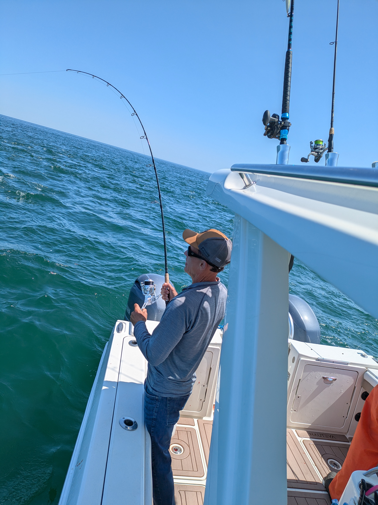

class: top, left

<style>
p.caption {
  font-size: 0.6em;
}
</style>

<style>
.reduced_opacity {
  opacity: 0.5;
}
</style>

```{r setup, include=FALSE}

options(htmltools.dir.version = FALSE)
knitr::opts_chunk$set(echo = F,
                      fig.retina = 3,
                      #fig.width = 4,
                      #fig.height = 2,
                      fig.asp = 0.45,
                      warning = F,
                      message = F)
#Plotting and data libraries
library(tidyverse)
library(here)
library(kableExtra)
library(DT)
library(widgetframe)
here::i_am("BlackSeaBass/20250620_RefresherRDMTool.Rmd")

options(scipen=0)

lbs_per_mt<-2204.62

# if figure output defaults to docs/images/ replace with this before moving to 
# presentations/docs in both the html output (search and replace)
# and folder name
# 20220316_MAFMCSSC_Gaichas_files/figure-html/

imagefolder<-"20250620_RefresherRDMTool"
imagefolder<-here("BlackSeaBass","20250620_RefresherRDMTool")


```

```{r, load_refs,include=FALSE, cache=FALSE}
library(RefManageR)

BibOptions(check.entries = FALSE,
           bib.style = "authoryear",
           cite.style = "authoryear",
           longnamesfirst = FALSE,
           max.names = 1,
           style = "markdown")
myBib <- ReadBib("./EconInformed.bib", check = FALSE)

# A large bib takes a while (10-20 seconds).
#,
#           hyperlink = FALSE,
#           dashed = FALSE

```

<!---
Use this to add a bottom note to a figure
.contrib[
Few managed species have binding limits; Management less likely playing a role
]

Use this to make a left list
.pull-left[

]

in-line cite with:  `r Cite(myBib, "carr2020expected")`
    + Contextual information
    + Report evolving since 2016
    + Fishery-relevant subset of full Ecosystem Status Reports

- Open science emphasis `r Cite(myBib, "bastille_improving_2020")`

- Used within Mid-Atlantic Fishery Management Council's Ecosystem Process `r Cite(myBib, "muffley_there_2020")`
 - Inline cite `r Citet(myBib, "muffley_there_2020")`


-->

# Staffing Changes

* Scott Steinback retired April 30, 2025.
  * Everyone on the team will pick up a little extra. 
  * We will probably miss some things.

.pull-left[
 
]


.pull-right[
 
]


---
# Funding Changes 

* Scott had secured about 4 years of Cloud Computing funds through the Social Science 
IRA Strategic Initiative:

  * 2024 half of the SFSBSB
  * 2025 Groundfish
  * 2026 SFSBSB and Groundfish
  * 2027 Groundfish
  * 2028 probably half of the SFSBSB and Groundfish

* NMFS recalled unobligated IRA funds on June 10, 2025.  None of those IRA funds will 
be spent on cloud computing.

* Social Sciences Branch is planning to pay for the half of 2024 and all of 2025.

* Not sure what we are going to do for 2026.


---
# Min-Yang and Rec Fishing I

 
 

 


---
# Min-Yang and Rec Fishing II

* Worked with Scott on the Groundfish RDM 1.0 for NEFMC from 2012-2023.

--

* Original RDM: One coast-wide set of size and bag limits for the year.

--

* We would bring a handful of prospective regulations to the NEFMC's RAP.
--

* Year 1 - cod stock status was poor, but the RDM said that regulatory changes needed would be minimal.

--


* Year 3 - cod stock status okay, but RDM advised some restrictions.


---

# 2024 Management cycle Timeline

* Monthly meetings from June 2023 to January 2024.

* RDM tool live in December 2023.

* A few bugs worked out by mid January of 2024.

---

# 2026 Management cycle Timeline


Today: 
* Refresher,
* Notable updates,
* Input on the User Interface,
* Input on model and data.

--

September 15: Prototype Mid-Atlantic model running in the cloud.

--

October 15: Preliminary Wave 4 MRIP data released.

--

November 1: Final Mid-Atlantic model running in the cloud.

<!---

.blue[December 1 -  Prototype New England model in the cloud]

.grey[December 15: Preliminary Wave 5 MRIP data released]

.grey[December 26: Final New England Model in the cloud]
--->


---
# Cloud Computing II

* In the 2024 cycle:
  * Users simulated over 330 policies at the state level
  * $14,600 on Cloud Computing
  * $10,200 on Setup and Optimizing 

* We are contingency planning for "no cloud" 

<!---
* For NE Groundfish in 2024, we spent:
  * $13,000 on Cloud Computing
  * $9,000 on Setup and Optimizing 

* 12 users ran a total of 45 different policies.
--->


