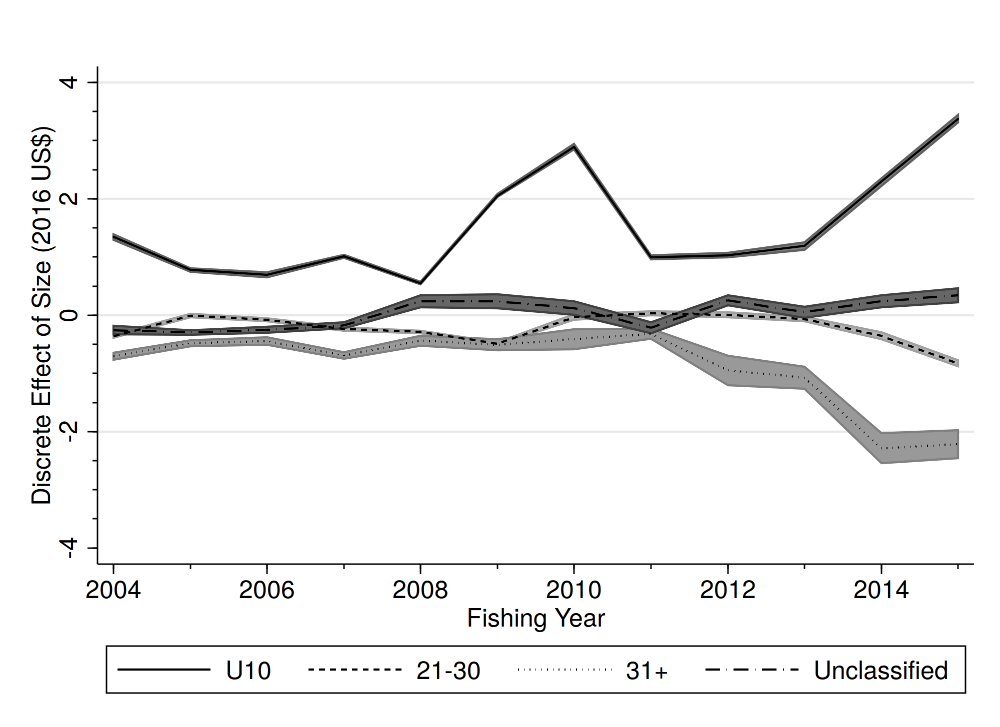
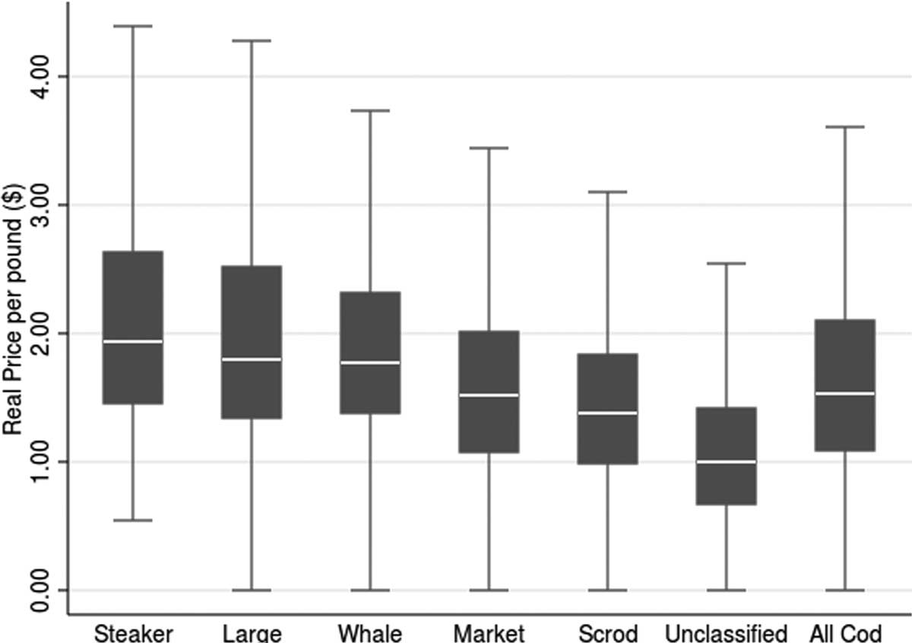
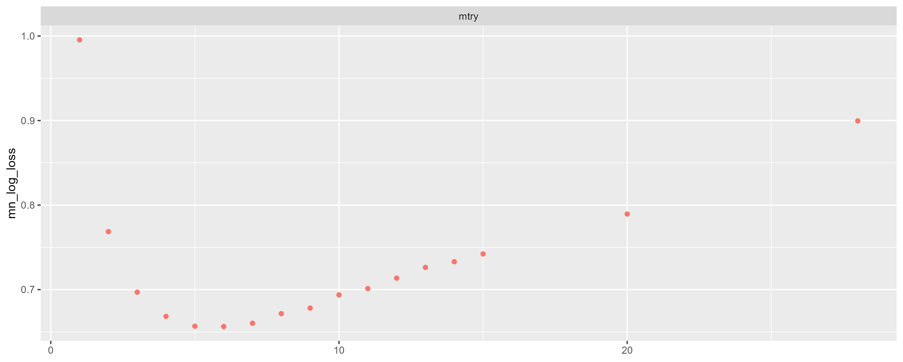

class: top, left

<style>
p.caption {
  font-size: 0.6em;
}
</style>

<style>
.reduced_opacity {
  opacity: 0.5;
}
</style>

```{r setup, include=FALSE}

options(htmltools.dir.version = FALSE)
knitr::opts_chunk$set(echo = F,
                      fig.retina = 3,
                      #fig.width = 4,
                      #fig.height = 2,
                      fig.asp = 0.45,
                      warning = F,
                      message = F)
#Plotting and data libraries
library(tidyverse)
library(here)
library(kableExtra)
library(DT)
library(widgetframe)
here::i_am("writing/presentations/2025_03_24_Economic_Informed_Stock_Assessments/2025_03_24_Economic_Informed_Stock_Assessments.Rmd")

# if figure output defaults to docs/images/ replace with this before moving to 
# presentations/docs in both the html output (search and replace)
# and folder name
# 20220316_MAFMCSSC_Gaichas_files/figure-html/

imagefolder<-here("writing","presentations","2025_03_24_Economic_Informed_Stock_Assessments")

mlogit_preds<-read.csv(here("writing","presentations","2025_03_24_Economic_Informed_Stock_Assessments","mlogit_predictions_raw.csv"))
mlogit_colfreq_preds<-read.csv(here("writing","presentations","2025_03_24_Economic_Informed_Stock_Assessments","mlogit_predictions_col_freq.csv"))
mlogit_rowfreq_preds<-read.csv(here("writing","presentations","2025_03_24_Economic_Informed_Stock_Assessments","mlogit_predictions_row_freq.csv"))


```

```{r, load_refs,include=FALSE, cache=FALSE}
library(RefManageR)

BibOptions(check.entries = FALSE,
           bib.style = "authoryear",
           cite.style = "authoryear",
           longnamesfirst = FALSE,
           max.names = 1,
           style = "markdown")
myBib <- ReadBib("../../../../library.bib", check = FALSE)

# A large bib takes a while (10-20 seconds).
#,
#           hyperlink = FALSE,
#           dashed = FALSE

```

<!---
Use this to add a bottom note to a figure
.contrib[
Few managed species have binding limits; Management less likely playing a role
]

Use this to make a left list
.pull-left[

]

in-line cite with:  `r Cite(myBib, "carr2020expected")`
    + Contextual information
    + Report evolving since 2016
    + Fishery-relevant subset of full Ecosystem Status Reports

- Open science emphasis `r Cite(myBib, "bastille_improving_2020")`

- Used within Mid-Atlantic Fishery Management Council's Ecosystem Process `r Cite(myBib, "muffley_there_2020")`
 - Inline cite `r Citet(myBib, "muffley_there_2020")`


-->

# Research Question and Motivation

## Research Question
Can inclusion of prices improve our ability to infer something about the size of the Unclassified Black Sea Bass?

## Motivation

* Another source of uncertainty stemmed from the fact that no length information on individuals in the unclassified market category have been sampled since 2020. Calculating the catch at length for 2021-2023 necessitated borrowing information from before 2020 which introduces additional uncertainty. [BSB management track assessment report]

* It is costly to collect length and age information.  Is trying to collect this information for all market categories the most efficient use of our resources?


---
# Background
For years, economists have asked the opposite question: how much more do buyers pay for large fish compared to small fish? `r Cite(myBib, "McConnell2000")`


Scallops `r Cite(myBib, "Ardini2018")`are a nice example with clean separation:



---
## Cod is another example

.pull-left[

]


.pull-right[

]

But the separation is not as clean.


.footnote[
`r Cite(myBib, "Lee2014")`
]

---
# Methods Overview I 

1. Exploratory data analysis step: Do prices vary by size? 
  - Estimate a hedonic model: the price per pound is a function of the transaction level attributes, like market category, gear, and time of year. 
  - A slightly more sophisticated way of checking that prices vary by market category than the box plots from the previous slide.
  
2. Estimate a categorical model (ordered or un-ordered logit or something related) with price as an explanatory variable. 
  - Validate the model with a k-fold cross validation. 
  - Predict out of sample for the unclassified market category.


---
# Methods Overview II 

3.  Train a random forest classification model on the four principle classes (Jumbo, Large, Medium, Small).  
  - **Test** and **train** with a k-fold cross-validation.
  - **Validate** on a hold-out sample.
  - **Predict** out of sample on the "Unclassified".
  
4. Using the results of (3) reconstruct a new length distribution of the landed black sea bass.  

---
## Potential Pitfalls

1.  Data is such a bear.
  - Less QA/QC on the "value" columns (value, sppvalue). 
  - State-level reporting.  There are rows in the dealer data that are state-level reports of sales by non-federal permits to non-federal dealers. 
      - If these are transactions (trip/subtrip) with true value, this is fine.
      - If these are transactions (trip/subtrip) with "imputed" or "assigned" value, they *probably cannot* be included in the model.
      - If these are aggregates of multiple transactions, they *probably cannot* be included, even if the true value reported.
2.  Price Separation: Prices need to vary by market category. 
  - No variation in prices across market categories, then it won't work
  - No need to assumed a particular price-size relationship
  - price-size relationship can change from year to year
  - Better if the price of ``Unclassified`` is between the price of two other categories.


---
##  Pitfalls 2
3. Dealers have their own diverse but persistent tendencies in terms of how they classify fish.
  * This suggests that the dealer id should go into the model as a factor variable. 
  * Example 1: Dealer A's Large is 17-20" while Dealer B's Large is 19-22"
  * Example 2: Dealer C only grades into "Large" or "Small"
  * Problem 1: Need to handle this properly in the $k-$fold cross validation, otherwise the training and validation datasets are not truly independent and the model fit measures are overly optimistic. 
  * Problem 2: Would want to include a dealer "fixed effect" as to account the dealer's tendencies.  If all observations of cluster $c$ are in fold $k$, then I don't know how you use that info to predict.
  * Problem 3: Inclusion of factor variables with many levels in a machine learning model can lead to overfitting.  Probably will switch to something like "fraction large", "fraction jumbo", etc, by a dealer over either a recent time period or 'before' the estimation dataset.

---
# Hedonic Results
.left-column[
- Estimates in the columns can be interpreted as the average price of a pound of Black Sea Bass for each market category.
- Not shown are the effects of factor variables for gear,  state, calendar year, and month.
- Not show are the effects of total landings and total landings$^2$.
]
.right-column[
```{r child=here("results","hedonic_table_market_cats.md")}
```
]
---
## Multinomial Logit
.left-column[
- Estimates greater than 1 indicate that increases in a predictor increase the 
chances of transaction being in a particular market category relative to large.
- Not shown are factor variables for month, year, and state
]
.right-column[
```{r child=here("results","mlogitNom_short.md")}
```
]

---
## Multinomial Logit predictions

I predicted each of the four class probabilities for every transaction.

I multiplied the predictions by the *lndlb* for each transaction and then summed by market category.

```{r}
kbl(mlogit_preds, digits=0,booktabs=T, align=c("l",rep('r',times=4)), caption =  "Predicted Category (mt) after a multinomial logit.  Main diagonal indicates a correct prediction, off diagonal terms are incorrect predictions. 2018-2024")  %>%
    #column_spec(5:8, width = "2cm")
    kable_styling(full_width = F) %>%
      row_spec(0,bold=FALSE) 

```
The mechanics of the logit mean that the model is correct: the row sums are equal to the column sums.


---
## Multinomial Logit predictions II


```{r}
kbl(mlogit_rowfreq_preds, digits=2,booktabs=T, align=c("l",rep('r',times=4)), caption =  "Predicted Category after a multinomial logit, expressed as a row frequency(2018-2024)")  %>%
    #column_spec(5:8, width = "2cm")
    kable_styling(full_width = F) %>%
      row_spec(0,bold=FALSE) 

```

This is kind of not great. Plus, it's an "in sample" prediction, so it's overly optimistic 

---
## Machine Learning with Random Forest

- I trained and tuned a Random Forest on 40% of my data.  I used 10% as a hold out sample. 
- More predictors, so it's not really a fair comparison to the logit. Factor have a *
   - Factors: Gear (5), Stockarea (2), state (9), Year (7), Month (12), Semester (2), Grade (1)  
   - Continuous: Price, Landed pounds
   - Frequency Weights: Landed Pounds
- Tuned with mtry in 1:11

---
## Preliminary fit assessments

 
.pull-left[

]
 
 .pull-right[

]

## Preliminary fit assessments

Fair..also wrong not from the same model fit as previous

.pull-right[

]
 
## Predictions

Haven't written the code yet. I can get the 'class predictions' for the "transactions", but
I haven't figured out how to get the weights out.

 
## Extensions
.left-column[
- Can we modify the way lengths have been borrowed?
- Can we apply these methods to other stocks?  Which stocks?
- If it works well, can port sampling effort be re-deployed away from categories that are hard to get?
]

.right-column[

]

---
## End Matter
.pull-left[
** Thank you to** 
- People
- Other People
]
.pull-right[
**Additional resources**
]

## References
.contrib[
```{r refs, echo=FALSE, results="asis", eval=TRUE}
PrintBibliography(myBib, .opts=list(max.names=3))
```
]

