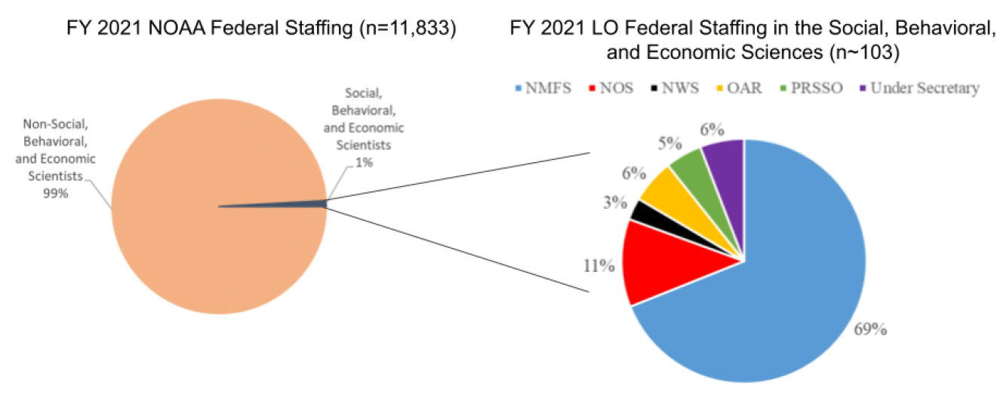
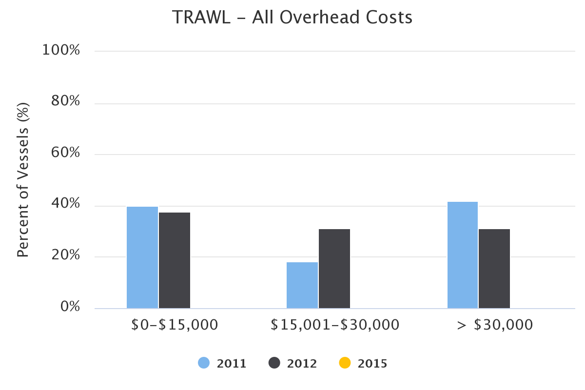
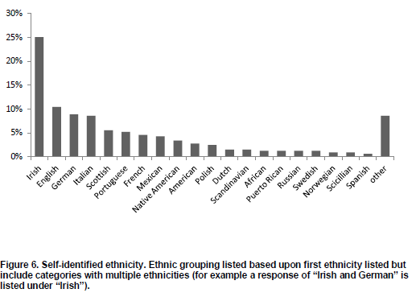
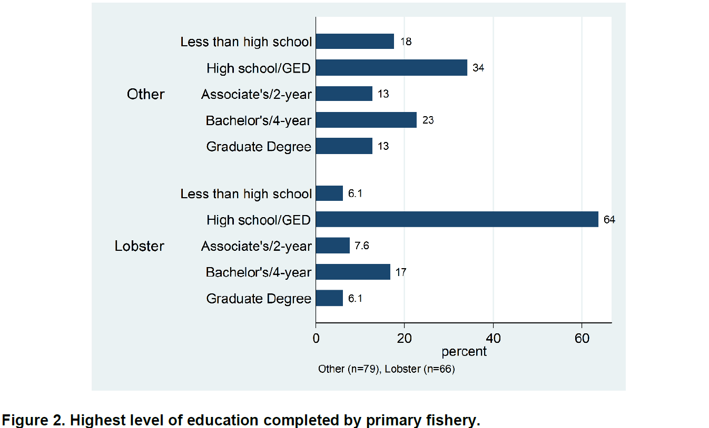
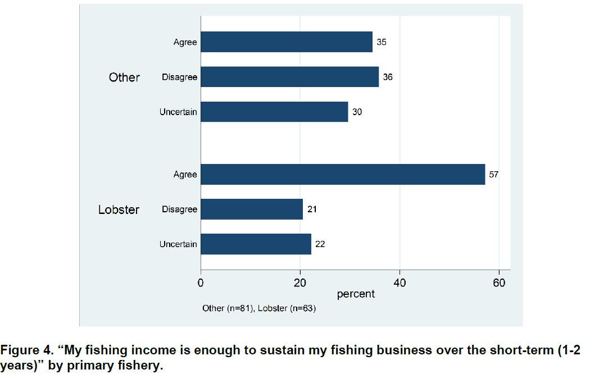
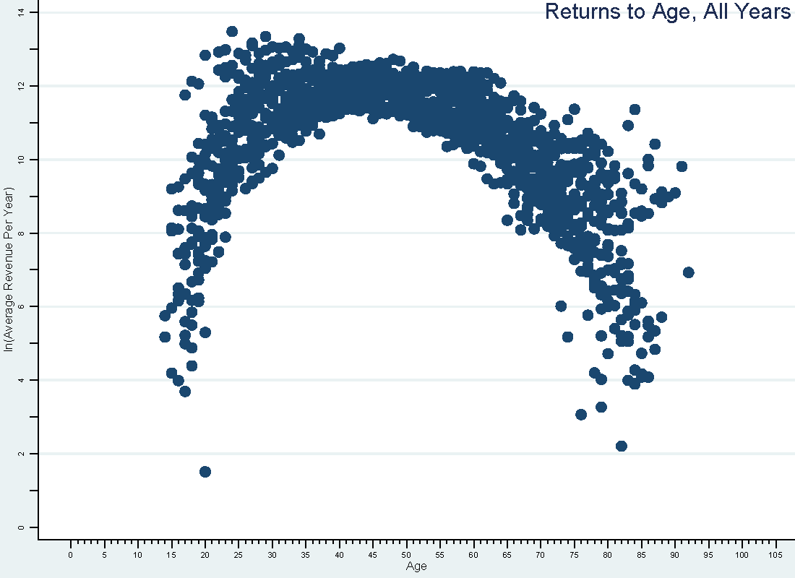
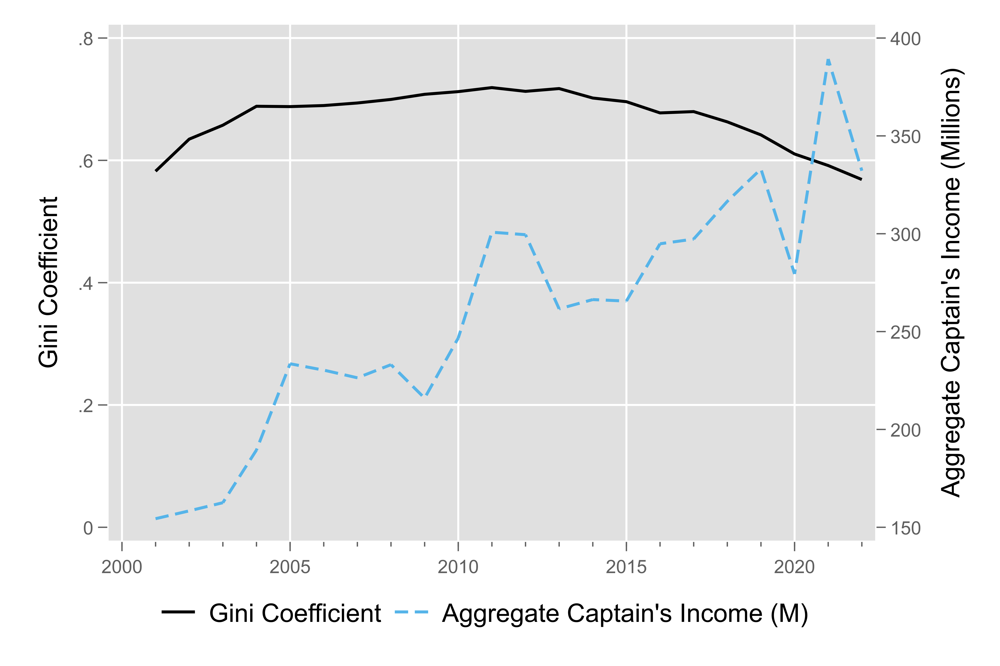

class: top, left

<style>
p.caption {
  font-size: 0.6em;
}
</style>

<style>
.reduced_opacity {
  opacity: 0.5;
}
</style>

```{r setup, include=FALSE}

options(htmltools.dir.version = FALSE)
knitr::opts_chunk$set(echo = F,
                      fig.retina = 3,
                      #fig.width = 4,
                      #fig.height = 2,
                      fig.asp = 0.45,
                      warning = F,
                      message = F)
#Plotting and data libraries
library(tidyverse)
library(here)
library(kableExtra)
library(DT)
library(widgetframe)

# if figure output defaults to docs/imaages/ replace with this before moving to 
# presentations/docs in both the html output (search and replace)
# and folder name
# 20220316_MAFMCSSC_Gaichas_files/figure-html/

imagefolder<-"20230717_DistributionofFisheryManagementBenefits_Lee"

```

```{r, load_refs, include=FALSE, cache=FALSE}
library(RefManageR)
BibOptions(check.entries = FALSE,
           bib.style = "authoryear",
           cite.style = "authoryear",
           longnamesfirst = FALSE,
           max.names = 1,
           style = "markdown")
myBib <- ReadBib("./Distribution.bib", check = FALSE)

#,
#           hyperlink = FALSE,
#           dashed = FALSE

```

<!---
Use this to add a bottom note to a figure
.contrib[
Few managed species have binding limits; Management less likely playing a role
]

Use this to make a left list
.pull-left[

]

in-line cite with:  `r Cite(myBib, "carr2020expected")`
    + Contextual information
    + Report evolving since 2016
    + Fishery-relevant subset of full Ecosystem Status Reports

- Open science emphasis `r Cite(myBib, "bastille_improving_2020")`

- Used within Mid-Atlantic Fishery Management Council's Ecosystem Process `r Cite(myBib, "muffley_there_2020")`
 - Inline cite `r Citet(myBib, "muffley_there_2020")`


# Assessing Equity in the Distribution of Fisheries Management Benefits
## Data and Information Availability

- Determine the categories of information required to adequately assess where and to whom the primary benefits of commercial and for-hire fishery management accrue;
- Determine what information currently exists within those categories and what additional information, if any, NOAA Fisheries would need to collect;
- Identify potential obstacles to collecting this additional data; 
- Identify methodologies the agency could use to assess the relative distribution of benefits from federal commercial and for-hire fishery management based on available information.

Not going to include this slide, just for reference.

## Some Questions

- What initiatives, if any, related to new socioeconomic data collection have been undertaken within your region?
- What issues or lessons learned are you (your region) experiencing with the current initiatives?
- Are there socioeconomic data collection efforts have been tried and have failed?
- Are there groups of people that you think are not being considered in current efforts but should be?
- Are there types of socioeconomic data related to equity that the Council is using/relying on in decision making?
- Are there types of data and/or analyses related to equity the Council is requesting?
- Are there differences in data/information needs for initially setting up a permit or allocation system vs monitoring changes in a fishery over time? 

Not going to include this slide, just for reference.

-->

# Data and Information Availability
.pull-left[
What do we have? .opinion[*In my opinion*, not nearly enough.]

.opinion[
*In my opinion*, this is due to  
- Under-investment in our ability to collect and analyse socioeconomic information
- Not well-understood by leadership  
- Not well-understood by people who would use this information
- Not well-communicated by our group
]
]
.pull-right[


- At Fisheries, there are approximately 15 social scientists and 50 economists.  Economists have the tools to tell a small part of any equity story.

- No Senior Executive Service Social Scientists at NOAA.

.footnote[
`r Citet(myBib, "Kast2023")`
]

]


---
##  Repurposing High-Frequency Data Collections
.pull-left[
Regtional datastreams primarily designed for monitoring catch and assessing stocks of fish 
-  Repurposed for socioeconomic analysis
-  Hard to examine distributions 
-  Only covers the harvest sector


```{r data-overview}
data_overview <- data.frame("Data Sources" = c("Vessel Permit Applications",
                                               "Fishing Vessel Trip Reports",
                                               "Seafood Dealer",
                                               "Observer (Sample)",
                                               "Rights Allocations and Transfers",
                                               "Operator Permits"),
"Data Collected" = c("Hailing Port; Principal Port; Mailing Addresses; Fishery Types; Ownership (firms and people)",
                    "Estimated Catch; Effort; Fishing Location; Gear; Number of Crew; Captain identifier; Landing Port",
                     "Landings; Revenue; Location of Buyer",
                    "Trip-level variable costs; Haul-level catch ",
                    "Days-at-Sea holdings; Quota holdings; Lease Values; Transfer Values",
                    "Date of Birth; Mailing Address"))
knitr::kable(data_overview, linesep = "",
      col.names = c("Data Sources","Data Collected"),
      caption = "Ongoing Data Collections in the Region",
      #align = 'c',
      booktabs = T) %>%
  kable_styling(font_size = 14) %>%
 # kable_styling(latex_options = "hold_position", "scale_down") %>%
 # column_spec(c(2), width = c("25em")) %>%
  row_spec(0, bold = TRUE) #%>%
 # group_rows("Provisioning/Cultural", 1,4) %>%
 # group_rows("Supporting/Regulating", 5,9)
#  pack_rows("Provisioning and Cultural Services", 1,6) %>%
#  pack_rows("Supporting and Regulating Services", 7,10)


```
]

.pull-left[
- Crew information
  - No crew registry or identifiers
  - No crew demographics
- Captain information
  - Minimal Demographics  
    - Sex, DoB, photo
  - No Race, ethnicity, household status
- Owner information
  - Firm name
  - Person's name
]


---
## Purpose-Built Socioeconomic Data Collections in Northeast Region
- Cost survey: 2011, 2015, 2023

- Crew Socioeconomic Survey: 2012, 2018, 2023

- Owner Socioeconomic Survey: 2013
- Recreational Valuation Surveys

- NOAA Voices Oral History Archives\*

- .grayed_out[American Seafood Harvesters Marketing Practices Survey\*]
- .grayed_out[Recreational Expenditure Survey\*]
.footnote[
\* National Projects
]

---
## Cost Survey
.pull-left[
- Population: Firms with a fishing permit
- A better understanding of firm level profits
    - Vessel Repair/Maintenance & Upgrade/Improvement Costs 
    - Vessel Fees and Insurance 
    - Overhead Costs
    - Crew Payments
    - Quota Costs
- Implementation is funded by NMFS OST
- **Issue** : low response rates
.footnote[
https://apps-nefsc.fisheries.noaa.gov/socialsci/cost-data/
]
]

.pull-right[


]

---
## Crew Socioeconomic Survey

.pull-left[
- Population: Crew of fishing vessels in the Northeast US.
- Assess the social and economic well-being of commercial fishing vessel crews 
<!--- - Better understand how management and environmental change affect important, socially vulnerable groups --->
- Examine trends in:
    -  Commercial fishing vessel crew demographics
    -  Views on fishery management
    -  Job satisfaction
- Implementation funded by NMFS OST


]
.pull-right[
Crew Survey Planned locations for 2023


]
.footnote[
`r Citet(myBib, c("Henry2014","cutler2022tracking"))`

https://www.fisheries.noaa.gov/new-england-mid-atlantic/socioeconomics/2023-commercial-fishing-crew-survey
]

---
## Owner Socioeconomic Survey

Gather data to inform the development of social indicators that fall under the broad performance measures of financial viability, distributional outcomes, governance, stewardship, and well-being `r Cite(myBib, "Cutler2017")`. 

.pull-left[
- Population: Owners of a fishing vessel with a Northeast US fishing permit in 2012
- Collect Vessel and Owner information
    - Primary landing port and mooring port, fishery
    - Marital status, age, educational attainment
    - Race and language at home
    - Years in the industry, family history
- Implementation was funded by NMFS OST
- **Issue**: No follow up planned
]


.pull-right[


]

---
##  Recreational Valuation Surveys
.pull-left[
- Population: Licensed recreational anglers in the Northeast US that target particular species 
- Examines effects of changes in numbers of landed and released fish on angler participation and utility
- Used to set fishing regulations
- Limited Demographics
- Implementation was funded by NMFS OST
- **Issue**: Focused on "hot" fisheries: 
  - Groundfish (3)
  - Striped Bass (1)
  - Summer Flounder (2)
]
.pull-right[


.footnote[
The Demographics Page from the 2022 Summer Flounder (Fluke) valuation survey.
]
]

---
## NOAA Voices Oral History Archives

.pull-left[
- Document the human experience as it relates to the changing environment, climate, oceans and coasts through firsthand oral history accounts
- Population: Communities and groups that are underrepresented in fisheries and fisheries management 
- Collected using a power-sharing data collection approach
    - crew
    - shoreside workers
    - immigrants
    - processing workers
    - small scale producers
    - rural producers
    - women

]


.pull-right[
Used to:
- Understand Equity and environmental Justice for minority groups
  - Gullah Geechee
  - Georgia black fishermen

- Understand the role of women in fisheries

- Understand disaster impacts
  - Deepwater Horizon Oil spill
  - Tsunami responses
  
- Parameterize stock assessment models for Gulf of Mexico Red Grouper
]


.warning[Voices funding scheduled to end in FY2024.]

---
## Are there socioeconomic data collection efforts have been tried and have failed?
.pull-left[
 - Vessel owners had strong, negative reactions to the demographic questions during survey pretesting for 2022. Demographics section was removed 
 
- Social Capital survey 
  - not approved by OMB
  - not championed by Fisheries Leadership

- Higher frequency cost survey (every 3 months)
]

.pull-right[
]


---
## Are there groups of people that you think are not being considered in current efforts but should be?
- Crew
  - Low-Frequency surveying

- Labor at Shoreside Infrastructure. In the Northeast US, they are frequently: 
  - Undocumented
  - South-American (non-Hispanic)
  - Female
  - Non-English speaking
  - Have fragile labor relations
- Shoreside infrastructure firms

- Consumers

- First Nations (in the Northeast US)

  .footnote[
https://thepublicsradio.org/article/-clear-vengeance-workers-threatened-with-termination-at-new-bedford-seafood-plant]


---
## Are there groups of people that you think are not being considered in current efforts?
- Future Generations
    - How will they afford to buy access rights from people who currently hold them?
    - How will groups that typically have poor access to capital markets find financing?

- People and groups that did not qualify
    - No fishing history
    - No documented fishing history

- "Subsistence" Recreational users (underserved community?)
    - Likely lower income and minority
    - Recreational measures sometimes have a "Trophy" (2 small fish, plus 1 very large).  The benefits of this are likely to accrue to affluent anglers.
    - Recreational measures sometimes that differ by mode (for-hire vs other).  This *may* shift benefits to affluent anglers or for-hire operators.  

- People who don't show up to Council meetings
  - Low expected gains `r Cite(myBib, "turner2005meetings")`
  - Can't afford the cost 

---
## Socioeconomic data related to equity that the Council is using?  Requesting?
- Typical analyses include breakdowns of revenues by:
  - Port
  - Gear
  - Vessel size
  - Analyses of non-qualifying firms
  
- More sophisticated or dissagregated metrics? 
    - Not really
    - We have limited ability to provide this information

- NE council has asked what we are doing on the EEJ front.
  - We have the EEJ strategy.
  - How do we implement? Who implements? 


---

## Common Issues and Obstacles
.pull-left[
Under-resourced 
 - Occasional Crew surveys
 - Occasional Cost surveys
 - Voices project being shuttered
 - Very small staff with qualitative focus
 
Under-Valued
  - Importance of qualitative data not understood by Fisheries leadership
    - what else are you going to ask,their shoe size?
  - Sentiment that nobody is going to use this information anyway.
    - Minimal support from affiliated stakeholders 
    - Decision makers don't know how to use qualitative info
]

.pull-right[
Not trusted 
  - "Destroying Fishermen and their Communities since 1976."
  - This information is going to be used against me 
]

---

## Common Issues and Obstacles
- Government
  - Office of Management and Budget 
      - PRA Process is onerous
      - Incentives for surveys are not permitted
  - Short-term funding to implement a survey does not lay the groundwork for a long-term partnership with fishing communities
  - Data governance

- A big imposition for Respondents
  - Survey Fatigue and Coordination
  - Voluntary data collections
  - Lots of time to take a survey
  - Questions are sensitive
  - Questions are difficult to answer

- Representativeness
    - Language barriers for minority populations
    - Scientific staff not diverse enough  
      - In demographic characteristics `r Cite(myBib, c("ando2023environmental", "kuminoff2023new"))`
      - In training 


---
# Other thoughts

- Framed as "Distribution of Fishery Management Benefits", but what about the costs?
  - Day-to-Day costs are split between public and private sector 
      - Going to meetings, 
      - Providing fishery management advice,
      - At-sea monitoring of catch,
      - Technology R&D. 
  - "Rare" costs also seem to be split
      - Fishery Disasters,
      - Rebuilding from overfished

- Although common in US Fisheries, an initial allocation does not *need* to be based on fishing history.

---

## Acknowledgements -- Thank you to:


- Greg Ardini

- Trish Clay

- Matt Cutler

- Patricia Pinto da Silva

- Samantha Werner


---
## References

.contrib[
```{r refs, echo=FALSE, results="asis", eval=TRUE}
PrintBibliography(myBib, .opts=list(max.names=3))
```
]


## Additional resources

.pull-left[
* [Crew Survey Landing Page](https://www.fisheries.noaa.gov/new-england-mid-atlantic/socioeconomics/2023-commercial-fishing-crew-survey)

* [Cost Data Visualization Tool](https://apps-nefsc.fisheries.noaa.gov/socialsci/cost-data/)

* [Performance Meaures Landings Page](https://apps-nefsc.fisheries.noaa.gov/socialsci/pm/index.php)

]
.pull-right[
]


---

## A Bit More Detail About the High-Frequency Data Collections 

.pull-left[
- Supports analysis at the level of the  
  - Fishing Vessel, Fishing Firm, Seafood Dealer 
  - Captain\* 
- Can be aggregated or disaggregated in
  - Time
  - Space
    - Communities
    - Communities At-Sea
  - By vessel, firm, or captain attributes
.footnote[
\* With increasingly tenuous assumptions and data processing.]
]

.pull-right[




]


