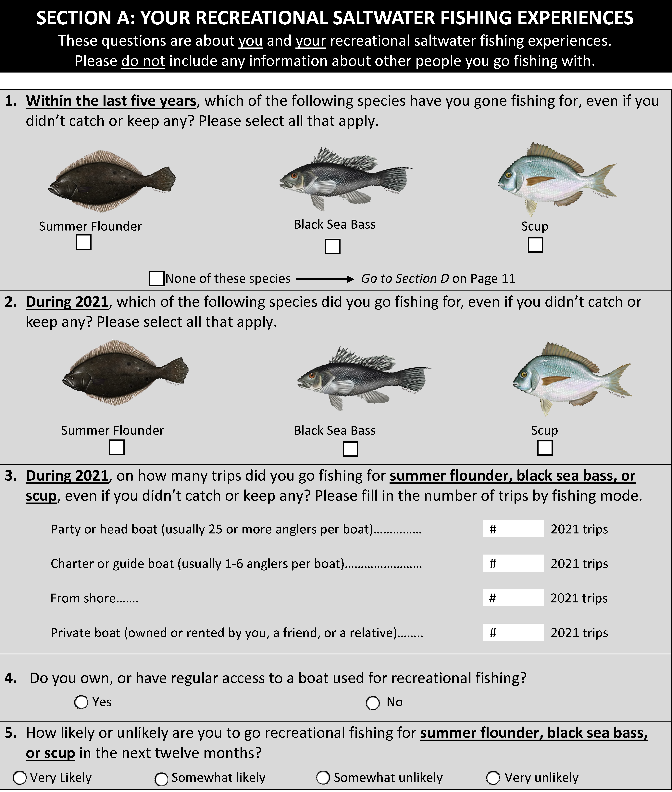

class: top, left

<style>
p.caption {
  font-size: 0.6em;
}
</style>

<style>
.reduced_opacity {
  opacity: 0.5;
}
</style>

```{r setup, include=FALSE}

options(htmltools.dir.version = FALSE)
knitr::opts_chunk$set(echo = F,
                      fig.retina = 3,
                      #fig.width = 4,
                      #fig.height = 2,
                      fig.asp = 0.45,
                      warning = F,
                      message = F)
#Plotting and data libraries
library(tidyverse)
library(tidyr)
library(here)
library(kableExtra)
library(readxl)
library(data.table)
library(DT)
library(widgetframe)

# if figure output defaults to docs/imaages/ replace with this before moving to 
# presentations/docs in both the html output (search and replace)
# and folder name
# 20220316_MAFMCSSC_Gaichas_files/figure-html/

```

```{r, load_refs, include=FALSE, cache=FALSE}
library(RefManageR)
BibOptions(check.entries = FALSE,
           bib.style = "authoryear",
           cite.style = "authoryear",
           longnamesfirst = FALSE,
           max.names = 1,
           style = "markdown")
myBib <- ReadBib("./Distribution.bib", check = FALSE)

#,
#           hyperlink = FALSE,
#           dashed = FALSE

```

<!---
Use this to add a bottom note to a figure
.contrib[
Few managed species have binding limits; Management less likely playing a role
]

Use this to make a left list
.pull-left[

]

in-line cite with:  `r Cite(myBib, "carr2020expected")`
    + Contextual information
    + Report evolving since 2016
    + Fishery-relevant subset of full Ecosystem Status Reports

- Open science emphasis `r Cite(myBib, "bastille_improving_2020")`

- Used within Mid-Atlantic Fishery Management Council's Ecosystem Process `r Cite(myBib, "muffley_there_2020")`
 

-->


# Assessing Equity in the Distribution of Fisheries Management Benefits
## Data and Information Availability

- Determine the categories of information required to adequately assess where and to whom the primary benefits of commercial and for-hire fishery management accrue;
- Determine what information currently exists within those categories and what additional information, if any, NOAA Fisheries would need to collect;
- Identify potential obstacles to collecting this additional data; 
- Identify methodologies the agency could use to assess the relative distribution of benefits from federal commercial and for-hire fishery management based on available information.


---
## Some Questions

- What initiatives, if any, related to new socioeconomic data collection have been undertaken within your region?
- What issues or lessons learned are you (your region) experiencing with the current initiatives?
- Are there socioeconomic data collection efforts have been tried and have failed?
- Are there groups of people that you think are not being considered in current efforts but should be?
- Are there types of socioeconomic data related to equity that the Council is using/relying on in decision making?
- Are there types of data and/or analyses related to equity the Council is requesting?
- Are there differences in data/information needs for initially setting up a permit or allocation system vs monitoring changes in a fishery over time? 

---
##  Ongoing Data Collections
.pull-left[
- Most of the socioeconomic analysis uses datastreams primarily designed for assessing stocks of fish, **not** purpose-built collections for socioeconomic analysis
- Supports analysis at level of the: 
  - Vessel or Dealer 
  - Firm  (collections of vessels)
  - Community 
      - Land based, like Ports, counties, or States
      - At-Sea
  - Individual (Captain)
]

.pull-right[
```{r data-overview}
data_overview <- data.frame("Data Sources" = c("Dealer",
                                               "Vessel Logbook",
                                               "Observer",
                                               "Vessel Permits",
                                               "Rights Allocations and Transfers",
                                               "Operator Permits"),
"Data Collected" = c("Landings; Revenue; Location of Buyer",
                               "Estimated Catch; Effort; Fishing Location; Gear; Number of Crew; Captain identifier",
                               "Trip-level variable costs; Haul-level catch",
                               "Hailing Port; Principal Port; Mailing Addresses; Fishery Types; Ownership (firms and people)",
                                "Days-at-Sea; Quota; Lease Values; Transfer Values",
                               "Date of Birth; Mailing Address"))
knitr::kable(data_overview, linesep = "",
      col.names = c("Data Sources","Data Collected"),
      caption = "Data Overview at NEFSC",
      #align = 'c',
      booktabs = T) %>%
  kable_styling(font_size = 14) %>%
 # kable_styling(latex_options = "hold_position", "scale_down") %>%
 # column_spec(c(2), width = c("25em")) %>%
  row_spec(0, bold = TRUE) #%>%
 # group_rows("Provisioning/Cultural", 1,4) %>%
 # group_rows("Supporting/Regulating", 5,9)
#  pack_rows("Provisioning and Cultural Services", 1,6) %>%
#  pack_rows("Supporting and Regulating Services", 7,10)


```
]


---
## New Socioeconomic Data Collections in Northeast Region

.pull-left[
Regular

- Crew Survey (2012/3, 2018/9, 2023)
- Cost survey (2011, 2012, 2015, 2023)
]

.pull-right[
Occasional and One-time

- Recreational Valuation Surveys
- American Seafood Harvesters Marketing Practices Survey
]

---
## Crew Survey
.pull-left[

- Population: Crew that work on fishing vessels in the Northeast US.
- Assess the social and economic well-being of commercial fishing vessel crews 
- Better understand how management and environmental change affect important, socially vulnerable groups
- Examine trends in:
    -  Commercial fishing vessel crew demographics
    -  Participation and practices
    -  Views on fishery management
    -  Job satisfaction
    -  Well-being over time 
- Can (cannot?) link back to vessels
- **Issue** : 
- **Issue** : 

.contrib[
https://www.fisheries.noaa.gov/new-england-mid-atlantic/socioeconomics/2023-commercial-fishing-crew-survey
]

]
.pull-right[
Crew Survey Planned locations for 2023


]

---
## Cost Survey
.pull-left[
- Population: Firms with a Northeast US fishing permit
- Enables a better understanding of firm level profits
- Collect Fixed and Quasi-fixed costs
    - Vessel Repair/Maintenance & Upgrade/Improvement Costs
    - Vessel Fees and Insurance
    - Trip Expenses
    - Overhead Costs
    - Crew Payments and Payment Systems
    - Quota Costs and Revenues
- Can (cannot?) link back to vessels
- **Issue** : 
- **Issue** : 

.contrib[
https://apps-nefsc.fisheries.noaa.gov/socialsci/cost-data/
]
]

.pull-right[


]

---
##  Recreational Valuation Surveys
.pull-left[
- Population: Recreational anglers in the Northeast US that target particular species 
- Examines effects of changes in numbers of landed and released fish on angler participation and utility
- Used to set fishing regulations
- Limited Demographics
  - Male/Female
  - Year of birth
  - Highest Education level
  - Household Income (brackets)
- **Issue** : 
- **Issue** : 
- **Lessons Learned** : 
]
.pull-right[


.contrib[
A sample page from the 2022 Survey used to value fishing opportunities for Summer Flounder (Fluke) in the region.
]
]


---
## Are there socioeconomic data collection efforts have been tried and have failed?


---
## Are there groups of people that you think are not being considered in current efforts but should be?

- Future Generations
    - How will they afford to buy access rights from people who currently hold them?
    - How will groups that typically have poor access to capital markets find financing?
- People and groups that did not qualify
    - No fishing history
    - No documented fishing history
- "Subsistence" Recreational users
    - Likely lower income
    - Likely minority
    - Less likely to participate in fishery management process
    - Recreational measures sometimes have a "Trophy" (2 small fish, plus 1 very large).  The benefits of this are likely to accrue to affluent anglers.
    - Recreational measures sometimes that differ by mode (for-hire vs other).  This *may* shift benefits to affluent anglers or for-hire operators.  


---
## Are there types of socioeconomic data related to equity that the Council is using/relying on in decision making?

---
## Are there types of data and/or analyses related to equity the Council is requesting?

---
## Are there differences in data/information needs for initially setting up a permit or allocation system vs monitoring changes in a fishery over time? 

---

## Acknowledgement Slide


---
## References

.contrib[
```{r refs, echo=FALSE, results="asis", eval=TRUE}
PrintBibliography(myBib)
```
]


## Additional resources
.pull-left[
]
.pull-right[
* [Crew Survey Landing Page](https://www.fisheries.noaa.gov/new-england-mid-atlantic/socioeconomics/2023-commercial-fishing-crew-survey)

* [Cost Survey Landing Page](https://apps-nefsc.fisheries.noaa.gov/socialsci/cost-data/)

* [Performance Meaures Landings Page](https://apps-nefsc.fisheries.noaa.gov/socialsci/pm/index.php)

]

