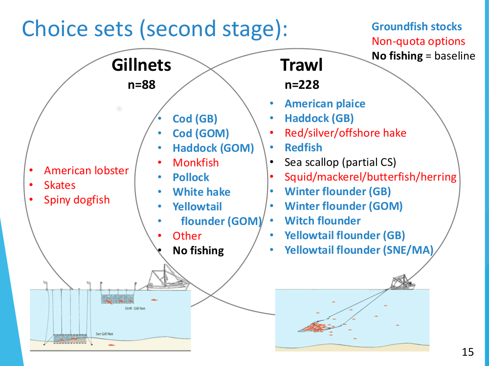
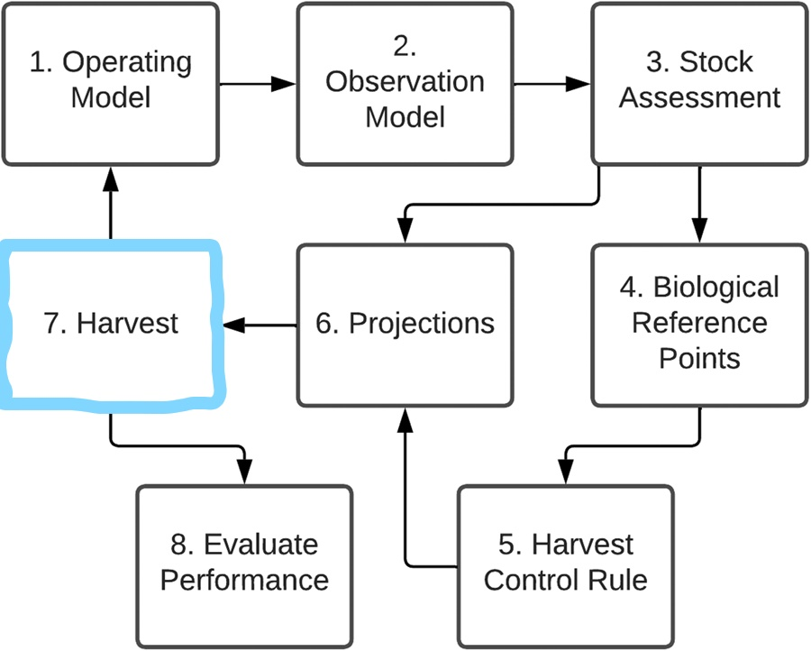
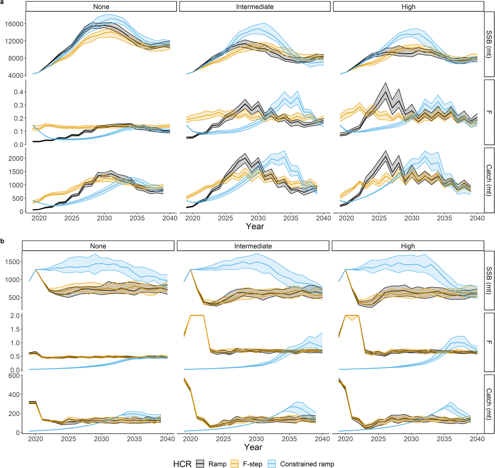

class: top, left

<style>
p.caption {
  font-size: 0.6em;
}
</style>

<style>
.reduced_opacity {
  opacity: 0.5;
}
</style>

```{r setup, include=FALSE}

options(htmltools.dir.version = FALSE)
knitr::opts_chunk$set(echo = F,
                      fig.retina = 3,
                      #fig.width = 4,
                      #fig.height = 2,
                      fig.asp = 0.45,
                      warning = F,
                      message = F)
#Plotting and data libraries
library(tidyverse)
library(here)
library(kableExtra)
library(DT)
library(widgetframe)

# if figure output defaults to docs/imaages/ replace with this before moving to 
# presentations/docs in both the html output (search and replace)
# and folder name
# 20220316_MAFMCSSC_Gaichas_files/figure-html/

imagefolder<-"20230717_DistributionofFisheryManagementBenefits_Lee"

```

```{r, load_refs, include=FALSE, cache=FALSE}
library(RefManageR)
BibOptions(check.entries = FALSE,
           bib.style = "authoryear",
           cite.style = "authoryear",
           longnamesfirst = FALSE,
           max.names = 1,
           style = "markdown")
myBib <- ReadBib("./groundfishMSE.bib", check = FALSE)

#,
#           hyperlink = FALSE,
#           dashed = FALSE

```

<!---
Use this to add a bottom note to a figure
.contrib[
Few managed species have binding limits; Management less likely playing a role
]

Use this to make a left list
.pull-left[

]

in-line cite with:  `r Cite(myBib, "carr2020expected")`
    + Contextual information
    + Report evolving since 2016
    + Fishery-relevant subset of full Ecosystem Status Reports

- Open science emphasis `r Cite(myBib, "bastille_improving_2020")`

- Used within Mid-Atlantic Fishery Management Council's Ecosystem Process `r Cite(myBib, "muffley_there_2020")`
 - Inline cite `r Citet(myBib, "muffley_there_2020")`


-->

# The Economic Model
.pull-left[

]

.pull-right[
Choice of what to do depends on:
- **Expected Revenues**
- **Quota Prices** 
- Fuel Prices
- A few other things
]
.footnote[
`r Citet(myBib, c("Birkenbach2023"))`
]

---
## Expected Revenues and Quota Prices

.pull-left[
Expected Revenues for a target are a function of
- **Bottom Trawl Survey Index** 
- Prices of fish
- Vessel-level
    - Skill at catching a target stock
    - Skill at catching (or avoiding) other species
]

.pull-right[
Quota Prices are a function of 
- **Quota Remaining**
- Prices of Fish
- Quarter of the Fishing Year
]

.footnote[
`r Citet(myBib, c("Lee2023"))`
]

---

# Integrating the Economic and Biological Models
Working to Integrate the Economic model of targeting into a 5 stock variant of the "Groundfish MSE" `r Citet(myBib, c("Mazur2023"))`.  Built out models for GB Yellowtail Flounder, Pollock, GB cod in addition to the existing GOM cod and GB Haddock.

.pull-left[

]


.pull-right[

]


---

# Integrating the Economic and Biological Models
.pull-left[
Feedback Loops
- Simulated trawl survey informs the expected revenue function
- ACLs from the management model constrain the fishing fleet
  - When an ACL is reached for stock $j$, vessels cannot:
      - retain stock $j$ 
      - target stocks that are jointly caught with $j$.  
- ACL minus cumulative catch equal Quota Remaining
  - As the amount of quota left decreases, quota prices rise
  - Changes in quota prices change the attractiveness of one target relative to another
]


.pull-right[
Uncomfortable Assumptions
- We have a model of the groundfish catch share fishery
  - Recreational fishing mortality
  - Canadian waters fishing mortality
- We use 2010-2015 to  simulate economic variables (input and output prices).
  - We draw randomly fishing years 2010-2015
  - We just use 2015 data
- What do we do for catch limits for stocks without a biological model?
  Same thing that we do for economic variables.
]
---
# An Experiment

How good (or bad) is a standard "Implementation Error" approach?


---


# Other thoughts

---
## End Matter
.pull-left[
** Thank you to** 
]
.pull-right[
**Additional resources**
]

## References
.contrib[
```{r refs, echo=FALSE, results="asis", eval=TRUE}
PrintBibliography(myBib, .opts=list(max.names=3))
```
]


