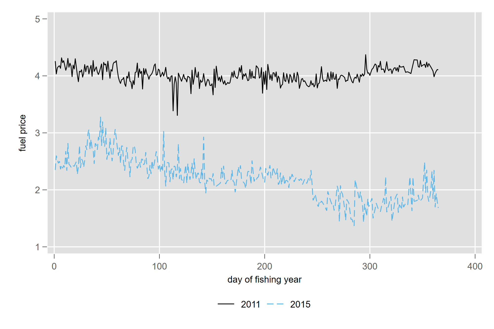
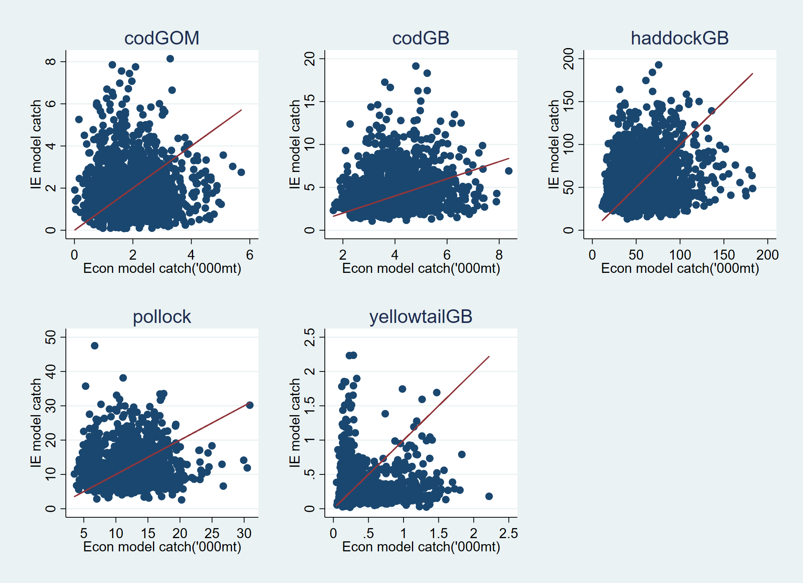

class: top, left

<style>
p.caption {
  font-size: 0.6em;
}
</style>

<style>
.reduced_opacity {
  opacity: 0.5;
}
</style>

```{r setup, include=FALSE}

options(htmltools.dir.version = FALSE)
knitr::opts_chunk$set(echo = F,
                      fig.retina = 3,
                      #fig.width = 4,
                      #fig.height = 2,
                      fig.asp = 0.45,
                      warning = F,
                      message = F)
#Plotting and data libraries
library(tidyverse)
library(here)
library(kableExtra)
library(DT)
library(widgetframe)

# if figure output defaults to docs/imaages/ replace with this before moving to 
# presentations/docs in both the html output (search and replace)
# and folder name
# 20220316_MAFMCSSC_Gaichas_files/figure-html/

imagefolder<-"20230717_DistributionofFisheryManagementBenefits_Lee"

```

```{r, load_refs, include=FALSE, cache=FALSE}
library(RefManageR)
BibOptions(check.entries = FALSE,
           bib.style = "authoryear",
           cite.style = "authoryear",
           longnamesfirst = FALSE,
           max.names = 1,
           style = "markdown")
myBib <- ReadBib("./groundfishMSE.bib", check = FALSE)

#,
#           hyperlink = FALSE,
#           dashed = FALSE

```

<!---
Use this to add a bottom note to a figure
.contrib[
Few managed species have binding limits; Management less likely playing a role
]

Use this to make a left list
.pull-left[

]

in-line cite with:  `r Cite(myBib, "carr2020expected")`
    + Contextual information
    + Report evolving since 2016
    + Fishery-relevant subset of full Ecosystem Status Reports

- Open science emphasis `r Cite(myBib, "bastille_improving_2020")`

- Used within Mid-Atlantic Fishery Management Council's Ecosystem Process `r Cite(myBib, "muffley_there_2020")`
 - Inline cite `r Citet(myBib, "muffley_there_2020")`


-->

## The Economic Model
.pull-left[
Every day, every captain $i$ chooses the primary target stock $j$ that gets the highest (expected) profits

$$P[Target_{ij}] =P(Revenue_{ij}, Costs_{ij}, Z_{ij})$$
Choice of what to do depends on:
- **Expected Revenues**
- **Quota Prices** 
- Fuel Prices
- A few other things


]

.pull-right[

.footnote[
Figure 3 from `r Citet(myBib, c("Birkenbach2023"))`: Simulated groundfish revenue differences (catch shares minus DAS).
]
]
.footnote[

]

---
## Expected Revenues and Quota Prices

.pull-left[
Expected Revenues for a target are a function of
- **Bottom Trawl Survey Index** 
- Prices of fish
- Vessel-level
    - Skill at catching a target stock
    - Skill at catching (or avoiding) other species

Quota Prices are a function of 
- **Quota Remaining**
- Prices of Fish
- Quarter of the Fishing Year

]


.pull-right[


.footnote[
Probability of positive price as a function of quota Remaining. As the amount of quota increases, the likelihood that a stock will trade at positive prices declines `r AutoCite(myBib, c("Lee2023"), .opts=list(max.names=2))`.
]
]
---

## Integrating the Economic and Biological Models

.pull-left[
Working to integrate the Economic model of targeting into a 5 stock variant of the "Groundfish-MSE" from `r Citet(myBib, c("Mazur2023"))`.  

Built out models for GB Yellowtail Flounder, Pollock, GB cod in addition to the existing GOM cod and GB Haddock.


]


.pull-right[

]


---

### Feedback Loops
- Simulated Bottom Trawl Survey informs the expected revenue function
  - Higher Index &rarr; more catch
  - Size of the Effect varies by species
- ACLs from the management model constrain the fishing fleet
  - When an ACL is reached for stock $j$, vessels cannot:
      - retain stock $j$ 
      - target stocks that are jointly caught with $j$
- ACL minus cumulative catch equal Quota Remaining
  - As the amount of quota left decreases, quota prices rise
  - Changes in quota prices change the attractiveness of one target relative to another


---
### Uncomfortable Assumptions
.pull-left[
- We have a model of the *groundfish catch share fishery*
  - Recreational, state-waters, other fleet fishing mortality
  - Canadian waters fishing mortality
- We use 2010-2015 data to simulate economic variables (input and output prices)
  - We draw randomly fishing years 2010-2015, OR
  - Us a single year of data (2015) data
- What do we do for biomass index and catch limits for stocks without a biological model?
  - Same thing that we do for economic variables.
]
.pull-right[



]
---
## Some SSB Trajectories

.pull-left[

Georges Bank Cod SSB Median trajectories
]


.pull-right[


Georges Bank Yellowtail SSB Median trajectories

]

---
## More results

.pull-left[

]

.pull-right[

]

Model 1: An economic model.  

Model 3: No implementation error.  

---
### How well does an "Implementation Error" approach work?
1. Simulate the economic model for 20 years using a random draw of years.
2. Assume that $errors=\frac{F}{F-Advice}$ are log-normally distributed, estimate the mean and variance of that distribution for each of the 5 stocks
3. Feed these estimated parameters into the "Implementation - Error" and simulate the model.
4. Repeat steps 1-3.

.pull-left[

]

.pull-right[
- Paired simulations don't match very well on any metric (SSB, Catch, etc)
- Not too surprising, though?
]

---
### How well does an "Implementation Error" approach work (v2) ?
1. Simulate the economic model for 20 years using a random draw of years.
2. Assume that $errors=\frac{F}{F-Advice}$ are log-normally distributed, estimate the mean and variance of that distribution for each of the 5 stocks
3. Feed these estimated parameters into the "Implementation - Error" and simulate the model .opinion[many times].
4. Repeat steps 1-3.

---
## More results

.pull-left[

]

.pull-right[

]

---

# Other thoughts

---
## End Matter
.pull-left[
** Thank you to** 
]
.pull-right[
**Additional resources**
]

## References
.contrib[
```{r refs, echo=FALSE, results="asis", eval=TRUE}
PrintBibliography(myBib, .opts=list(max.names=3))
```
]


